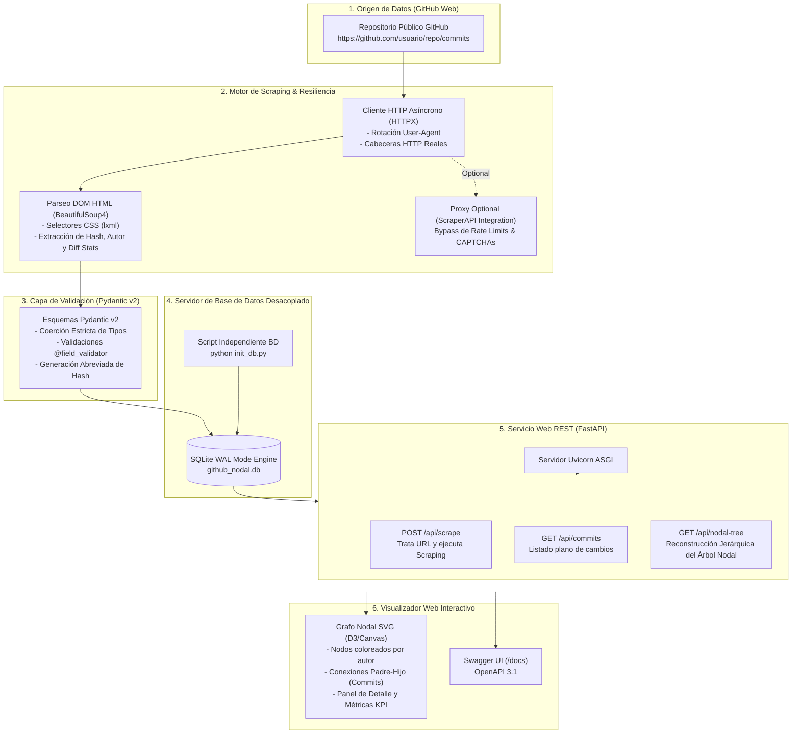

## Lenguaje de Programación Visual  
### Ingeniería Mecatrónica - FIUNA

**Semana 4 y 5: Validación de Datos con Pydantic v2, Web Scraping con BeautifulSoup4/HTTPX y FastAPI: Registro y Árbol Nodal de Cambios en Repositorios GitHub**

---

**Profesor Titular:** Ing. Jorge Luis Tillería Mereles  
**Auxiliar de Práctica:** Univ. Carlos María Benítez Cardozo  
**Facultad de Ingeniería - Universidad Nacional de Asunción (FIUNA)**  
**Ciclo 2026-02**

---



---

## Requisitos Previos y Configuración del Entorno

Antes de ejecutar el servidor, el script de base de datos o el notebook de Jupyter, active el entorno virtual de la materia **`lpv2026-2`** e instale las dependencias gestionadas con **Poetry**:

```bash
# 1. Activar el entorno virtual de la materia
conda activate lpv2026-2

# 2. Navegar al directorio del proyecto consolidado (Semana 4 y 5)
cd proyecto_github_nodal

# 3. Vincular el entorno lpv2026-2 con Poetry e instalar dependencias
poetry env use python
poetry install
```

---

## PARTE 1: La Problemática de los Tipos en Python y la Solución con Pydantic v2

### 1.1 El Tipado Dinámico y sus Riesgos en Producción

Python es un lenguaje de **tipado dinámico y tipado fuerte**. Esto significa que las variables se determinan en tiempo de ejecución y no requieren declaraciones explícitas de tipo. Si bien esta característica brinda flexibilidad y aceleración en las fases iniciales de desarrollo, introduce severas vulnerabilidades en sistemas complejos y servicios web:

1. **Ausencia de Verificación en Compilación:** Un fallo de discrepancia de tipos (por ejemplo, intentar sumar una cadena `'120'` proveniente de una etiqueta HTML con un entero `5`) solo se manifestará cuando el hilo de ejecución pase por dicha línea.
2. **Duck Typing Indefenso:** En Python se suele asumir que "si camina como un pato y cuaca como un pato, es un pato". Sin embargo, si un payload JSON o el raspado HTML omite un atributo o envía `None` en lugar de una estructura válida, se desatará un `AttributeError: 'NoneType' object has no attribute ...`.
3. **Inestabilidad en Web Scraping y consumo de APIs:** El contenido extraído del DOM de páginas web siempre retorna cadenas de texto (`str`). Procesar manualmente cadenas a enteros, fechas o hashes mediante `try/except` dispersos contamina el código fuente y dificulta la mantenibilidad.

### 1.2 La Evolución hacia Type Hints (`typing`)

A partir de Python 3.5+, se introdujeron las anotaciones de tipo o *Type Hints*. En Python 3.10+, la sintaxis se simplificó usando operadores de unión (`|`):

```python
# Sin Type Hints (Problemático)
def procesar_commit(hash, adiciones):
    return hash.lower() + " - líneas: " + (adiciones + 10) # Falla si adiciones es str

# Con Type Hints de Python 3.10+
def procesar_commit(hash: str, adiciones: int | float) -> str:
    return f"{hash.lower()} - líneas: {adiciones + 10}"
```

No obstante, los Type Hints en Python son **puramente informativos**: el intérprete de Python ignora las anotaciones en tiempo de ejecución y no realiza ninguna validación por sí mismo.

### 1.3 Pydantic v2: Validación Estricta y Coerción de Tipos

**Pydantic** es la librería estándar de la industria para la validación de datos y la gestión de configuraciones en Python. Su segunda versión (Pydantic v2) fue reescrita en **Rust** (`pydantic-core`), ofreciendo un rendimiento entre 5x y 20x más rápido que la versión anterior.

```python
from datetime import datetime
from pydantic import BaseModel, Field, field_validator

class CommitModel(BaseModel):
    hash: str = Field(..., min_length=7, max_length=40)
    author_username: str
    additions: int = Field(0, ge=0)
    timestamp: datetime = Field(default_factory=datetime.utcnow)

    @field_validator("hash")
    @classmethod
    def clean_hash(cls, v: str) -> str:
        v_clean = v.strip().lower()
        if not v_clean.isalnum():
            raise ValueError("El hash debe ser alfanumérico.")
        return v_clean

# Coerción automática en acción:
data_cruda = {
    "hash": "A1B2C3D4E5F67890",
    "author_username": "tiangolo",
    "additions": "250",  # Pydantic coerce la cadena '250' al entero 250
    "timestamp": "2026-09-03T17:00:00Z"  # Parseo automático a objeto datetime
}

commit_valido = CommitModel(**data_cruda)
print(commit_valido.additions) # 250 (int)
```

**Ventajas clave de Pydantic v2 para nuestro proyecto:**
- **Coerción Intelligente:** Transforma automáticamente tipos compatibles (ej. `"120"` $\rightarrow$ `120`).
- **Validación Estricta:** Rechaza inmediatamente entradas inválidas emitiendo un `ValidationError` con detalles precisos.
- **Serialización Limpia:** Métodos nativos `.model_dump()` y `.model_dump_json()` para conversión instantánea a diccionarios o formato JSON.

---

## PARTE 2: Planteamiento del Problema: Registro y Árbol Nodal de Cambios en Repositorios de GitHub

### 2.1 Formulación del Problema de Ingeniería

En grandes proyectos mecatrónicos y de software (como repositorios de control de vuelo, microsoftware de vehículos autónomos o marcos de trabajo como *FastAPI*), múltiples desarrolladores efectúan cientos de cambios diarios.

El desafío consiste en:
1. **Rastrear y registrar** cada modificación (commit) realizada en un repositorio público de GitHub.
2. **Reconstruir la genealogía nodal (Parent-Child Tree):** Cada commit posee una referencia a su commit antecedente (`parent_hash`). Determinar esta jerarquía permite estructurar un **Árbol Nodal de Cambios** para auditar qué desarrollador introdujo cada cambio y en qué rama.
3. **Consumir y Visualizar:** Exponer estos datos validados mediante un servicio REST en servidor y ofrecer un panel gráfico interactivo.

---

### 2.2 Arquitectura de Web Scraping (Basada en la Guía de ScraperAPI)

Para extraer los datos sin depender exclusivamente de las cuotas limitadas de la API oficial de GitHub, implementamos un motor de **Web Scraping** avanzado basándonos en los principios expuestos en el tutorial de *ScraperAPI*:

1. **Cliente HTTP con Rotación de Cabeceras (`httpx`):**
   Para evitar que el servidor de GitHub bloquee la conexión con código HTTP 403 / 429, el motor rota dinámicamente las cabeceras `User-Agent` simulando navegadores reales (*Chrome, Firefox, Safari*).

2. **Parseo del DOM HTML con `BeautifulSoup4` (`bs4`):**
   Utilizando los selectores CSS y el analizador rápido `lxml`, se extraen los nodos de la estructura HTML:
   - Identificador SHA-1 del commit (`hash`).
   - Mensaje del cambio y autor (`@username`).
   - Avatar del usuario y cantidad de líneas modificadas (`additions` / `deletions`).
   - Puntero al commit padre (`parent_hash`).

3. **Manejo de Proxies (ScraperAPI Integration):**
   El motor incluye un conector directo que permite enrutar las peticiones por el servicio de proxies residenciales de ScraperAPI mediante `http://api.scraperapi.com?api_key=...&url=...`.

---

### 2.3 Servidor de Base de Datos Desacoplado (`init_db.py` / `database.py`)

La capa de almacenamiento está diseñada para correr de manera **independiente** al servicio web. Utiliza **SQLite** configurado en modo **WAL (Write-Ahead Logging)**, lo que permite lecturas concurrentes simultáneas por parte de la API REST mientras el motor de scraping escribe nuevos registros.

Para inicializar la base de datos de manera independiente, ejecute:

```bash
poetry run python init_db.py
```

Tablas del modelo relacional:
- `authors`: Registro de usuarios/desarrolladores (nombre, username, avatar).
- `commit_nodes`: Registro principal de nodos del árbol (hash, parent_hash, fecha, adiciones, eliminaciones).
- `file_changes`: Detalle individual de archivos modificados por commit.

---

### 2.4 Servicio Web API REST con FastAPI (`main.py`)

La API REST expone endpoints clave:

- `POST /api/scrape`: Recibe la URL del repositorio GitHub objetivo (ej. `https://github.com/fastapi/fastapi`), ejecuta el scraping, valida los datos con Pydantic y actualiza la base de datos.
- `GET /api/commits`: Retorna la lista plana de commits ordenados cronológicamente.
- `GET /api/nodal-tree`: **Reconstruye recursivamente la jerarquía arborescente del grafo de cambios**, devolviendo los nodos raíz con sus respectivas listas de nodos hijos (`children: [...]`).
- `GET /api/stats`: Consolida estadísticas generales (total de commits, adiciones, eliminaciones, autores).

---

### 2.5 Visualizador Web Interactivo del Árbol Nodal (`static/index.html`)

El proyecto incluye una aplicación web de página única (SPA) desarrollada con **HTML5, CSS3 (Glassmorphism & Modo Oscuro)** y **JavaScript**:

- Renderiza el **Grafo Nodal en tiempo real** utilizando el lienzo SVG.
- Conecta dinámicamente los nodos del árbol mediante curvas Bézier (`stroke-dasharray`), diferenciando los nodos raíz de sus descendientes.
- Permite hacer clic en cualquier nodo para inspeccionar los detalles completos del commit en un modal lateral.
- Contiene un panel para desencadenar scrapings en tiempo real de cualquier repositorio de GitHub.

---

## Guía de Verificación y Pruebas del Proyecto

### 1. Ejecutar las Pruebas Unitarias de Pydantic y Scraping

```bash
poetry run pytest -v
```

### 2. Poner en Marcha el Servidor de Desarrollo

```bash
poetry run uvicorn main:app --reload --port 8000
```

### 3. Probar la Interfaz y la API REST

1. Abra su navegador en **[http://127.0.0.1:8000/](http://127.0.0.1:8000/)** para interactuar con el **Visualizador del Árbol Nodal**.
2. Abra **[http://127.0.0.1:8000/docs](http://127.0.0.1:8000/docs)** para probar los endpoints interactivos desde la interfaz de Swagger UI.
