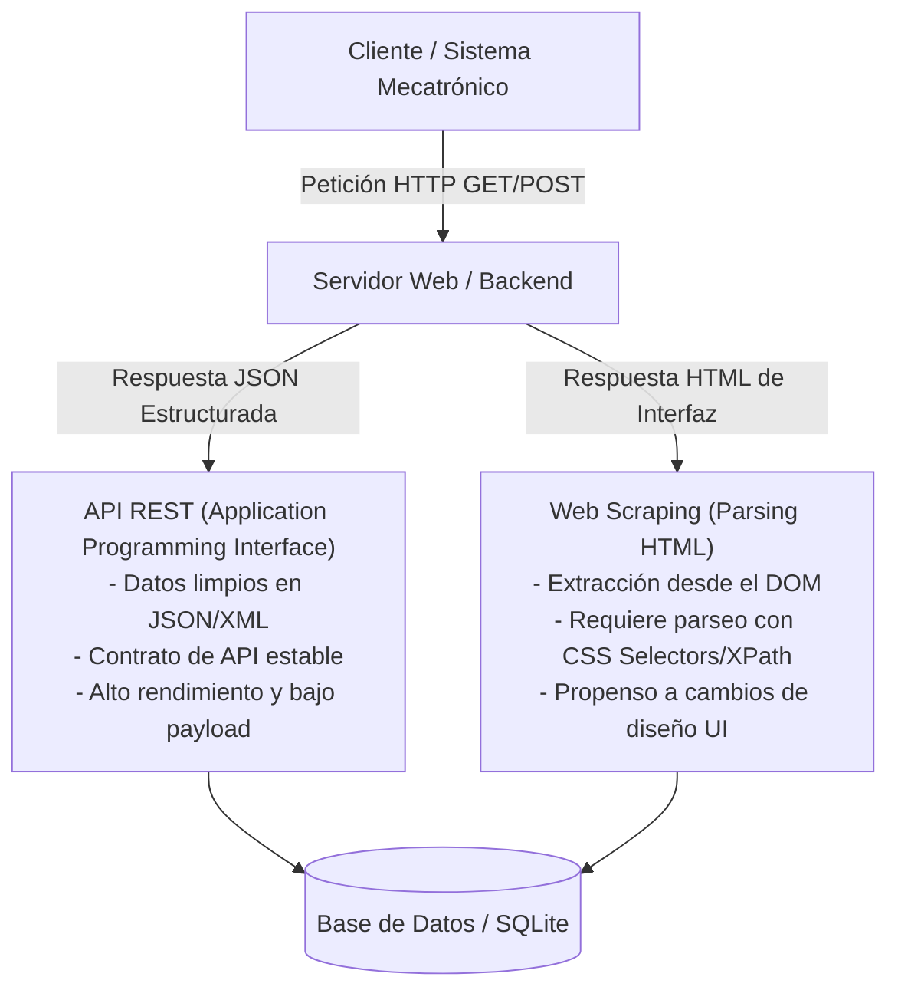
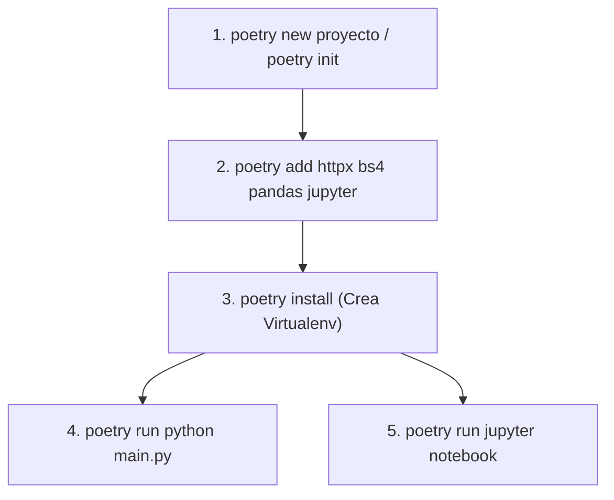

## Lenguaje de Programación Visual  
### Ingeniería Mecatrónica - FIUNA

**Semana 4: APIs REST, Protocolo HTTP y Web Scraping de Alto Nivel**

---

## 1. Arquitectura de la Web: REST APIs vs. Web Scraping

La adquisición de datos remotos es una capacidad indispensable en la mecatrónica moderna, la robótica conectada y los sistemas IoT. Existen dos mecanismos principales para obtener información de servidores web: la extracción estructurada mediante **APIs REST** y la extracción desde documentos de interfaz humana mediante **Web Scraping**.



### 1.1 Comparativa Técnica y Arquitectónica

| Característica | APIs REST (Application Programming Interface) | Web Scraping (Parsing de Documentos HTML) |
| :--- | :--- | :--- |
| **Estructura de Salida** | Datos estructurados estándar (**JSON**, XML, Protocol Buffers). | Texto no estructurado extraído de etiquetas **HTML/DOM**. |
| **Estabilidad y Mantenimiento** | **Alta**. Basada en contratos de API con versionado (ej. `/api/v1/`). | **Media-Baja**. Sensible a cambios sintácticos o de diseño en el frontend. |
| **Eficiencia de Ancho de Banda** | **Máxima**. Transporta únicamente los datos crudos requeridos. | **Menor**. Carga plantillas CSS, layouts y etiquetas HTML innecesarias. |
| **Autenticación y Autorización** | Estandarizada mediante **API Keys**, Bearer Tokens (JWT) u OAuth2. | Manejo manual de galletas (**Cookies**), sesiones HTTP y *bypassing*. |
| **Legalidad y Políticas de Uso** | Delimitada explícitamente por términos de uso del desarrollador. | Regulada por términos de servicio del sitio y `robots.txt`. |
| **Librerías Python Habituales** | `httpx`, `requests`, `aiohttp`, `pydantic`. | `beautifulsoup4`, `selectolax`, `lxml`, `playwright`. |

---

### 1.2 Ejemplo de Consumo de API REST en Python (`httpx`)

Las APIs REST exponen *endpoints* HTTP que retornan objetos estructurados (generalmente JSON), los cuales se deserializan directamente a diccionarios de Python:

```python
import httpx

# Endpoint público de clima para estación mecatrónica
URL_API = "https://api.open-meteo.com/v1/forecast"
PARAMS = {
    "latitude": -25.2637,  # Asunción, Paraguay
    "longitude": -57.5759,
    "current_weather": True
}

with httpx.Client(timeout=10.0) as client:
    response = client.get(URL_API, params=PARAMS)
    response.raise_for_status()  # Valida estado HTTP 200 OK
    
    data = response.json()
    clima_actual = data["current_weather"]
    print(f"Temperatura Actual: {clima_actual['temperature']} °C")
    print(f"Velocidad del Viento: {clima_actual['windspeed']} km/h")
```

---

### 1.3 Ejemplo de Web Scraping de Alto Nivel (`BeautifulSoup4`)

Cuando un servicio no provee una API pública REST, se consulta el documento HTML directamente y se analiza su Árbol DOM (*Document Object Model*) utilizando **Selectores CSS**:

```python
import httpx
from bs4 import BeautifulSoup

URL_WEB = "https://news.ycombinator.com/"
HEADERS = {"User-Agent": "MecatronicaBot/1.0 (FIUNA Educational Project)"}

with httpx.Client(headers=HEADERS, timeout=10.0) as client:
    response = client.get(URL_WEB)
    
    # Parseo sintáctico del documento HTML con html.parser
    soup = BeautifulSoup(response.text, "html.parser")
    
    # Extracción mediante Selectores CSS (.titleline > a)
    titulares = soup.select(".titleline > a")
    for idx, item in enumerate(titulares[:5], start=1):
        print(f"{idx}. {item.get_text()} -> {item.get('href')}")
```

---

## 2. Manual Completo de APIs REST y Web Scraping

---

### 2.1 Protocolo HTTP y Arquitectura REST

El protocolo **HTTP** (*Hypertext Transfer Protocol*) opera sobre el modelo cliente-servidor mediante peticiones (*Requests*) y respuestas (*Responses*).

#### Anatomía de una Petición HTTP
Una petición contiene:
1. **Método HTTP (Verbo):** Indica la acción requerida.
2. **URI / URL:** Dirección del recurso.
3. **Encabezados (Headers):** Metadatos de la transmisión (`Content-Type`, `User-Agent`, `Authorization`).
4. **Cuerpo (Body):** Carga útil de datos (habitualmente en peticiones `POST` o `PUT`).

#### Verbos HTTP Fundamentales (CRUD RESTful)
* **`GET`**: Solicita la lectura de un recurso. No debe alterar el estado del servidor (Idempotente y Seguro).
* **`POST`**: Envía datos al servidor para crear un nuevo recurso.
* **`PUT`**: Reemplaza completamente un recurso existente o lo crea si no existe.
* **`PATCH`**: Modifica parcialmente un recurso existente.
* **`DELETE`**: Elimina un recurso específico del servidor.

#### Códigos de Estado HTTP (*Status Codes*)

| Rango | Clase | Ejemplos Clave | Descripción |
| :--- | :--- | :--- | :--- |
| **2xx** | **Éxito** | `200 OK`, `201 Created` | La petición fue recibida, entendida y procesada correctamente. |
| **3xx** | **Redirección** | `301 Moved Permanently`, `302 Found` | El cliente debe realizar acciones adicionales para completar la petición. |
| **4xx** | **Error del Cliente** | `400 Bad Request`, `401 Unauthorized`, `403 Forbidden`, `404 Not Found`, `429 Too Many Requests` | Petición mal formada, falta de autenticación, recurso inexistente o sobrepaso de límite de tasa. |
| **5xx** | **Error del Servidor**| `500 Internal Server Error`, `502 Bad Gateway`, `503 Service Unavailable` | El servidor falló al procesar una petición válida. |

---

### 2.2 Técnicas Avanzadas de Web Scraping

#### Selectores CSS vs XPath

```html
<!-- Ejemplo DOM de Tabla de Sensores -->
<table id="sensores-estacion">
    <tr class="sensor-row" data-id="101">
        <td class="nombre">Sensor Térmico A1</td>
        <td class="lectura">24.85</td>
    </tr>
</table>
```

* **Selectores CSS (Recomendado por velocidad y legibilidad):**
  * `table#sensores-estacion`: Selecciona la tabla por ID.
  * `.sensor-row .lectura`: Selecciona la celda de lectura dentro de filas de sensores.
* **XPath (Permite navegación bidireccional y filtrado por texto exacto):**
  * `//table[@id='sensores-estacion']//td[contains(@class, 'lectura')]`

#### Gestión de Anti-Scraping y Buenas Prácticas
1. **User-Agent Rotation & Spoofing:** Identificar las peticiones con cabeceras realistas para evitar bloqueos por cortafuegos de capa 7.
2. **Rate Limiting & Delays:** Introducir pausas entre peticiones (`time.sleep` o `asyncio.sleep`) para respetar la capacidad del servidor objetivo.
3. **Manejo de Reintentos (Exponential Backoff):** Reintentar automáticamente las peticiones fallidas ante errores temporales de red o HTTP 503/429.
4. **Reutilización de Sesiones:** Emplear `httpx.Client()` o `requests.Session()` para mantener conexiones TCP persistentes (HTTP Keep-Alive).

---

### 2.3 Persistencia Continua en Bases de Datos Relacionales (SQLite)

El patrón estándar para aplicaciones de monitoreo consiste en desacoplar el pipeline de adquisición (API REST / Scraper) de la base de datos relacional:

```sql
-- Tabla relacional optimizada para almacenamiento continuo de telemetría y scraping
CREATE TABLE IF NOT EXISTS registro_sensores (
    id INTEGER PRIMARY KEY AUTOINCREMENT,
    origen VARCHAR(50) NOT NULL,          -- 'REST_API' o 'WEB_SCRAPER'
    parametro VARCHAR(50) NOT NULL,       -- 'temperatura', 'viento', 'presion'
    valor REAL NOT NULL,
    unidad VARCHAR(10) NOT NULL,
    registrado_en TIMESTAMP DEFAULT CURRENT_TIMESTAMP
);

-- Índice temporal para acelerar consultas analíticas
CREATE INDEX IF NOT EXISTS idx_registros_fecha ON registro_sensores(registrado_en);
```

---

## 3. Guía de Configuración de Entornos con Poetry y Jupyter

**Poetry** es la herramienta moderna estándar para la gestión de dependencias y empaquetado en Python. Garantiza entornos 100% reproducibles mediante resolución determinista en `poetry.lock`.



### Comandos Esenciales de Poetry
* **Inicializar proyecto:** `poetry init`
* **Instalar dependencias:** `poetry add httpx beautifulsoup4 pandas jupyter`
* **Instalar dependencias de desarrollo:** `poetry add pytest --group dev`
* **Sincronizar el entorno:** `poetry install`
* **Ejecutar comandos en el entorno:** `poetry run python <script.py>`
* **Iniciar sesión interactiva:** `poetry shell`

---

## 4. Ejemplos y Proyectos del Repositorio

En este repositorio se proveen proyectos prácticos de referencia modularizados para la asignatura:

### [Proyecto 1: Concurrencia y Persistencia Temporal (Asyncio + SQLite)](proyecto_sqlite_asyncio/README.md)
* **Descripción:** Adquisición masiva concurrente de sensores simulados I/O Bound mediante corrutinas de `asyncio`, desacoplamiento mediante colas asíncronas (`asyncio.Queue`) y almacenamiento transaccional continuo en SQLite con transmisión WAL.

---

### [Proyecto 2: Visualizador GUI e Integración Cloud (PyQt6 + Supabase)](proyectoPyQT6_supabase/README.md)
* **Descripción:** Aplicación gráfica de escritorio desarrollada en **PyQt6** conectada al Backend-as-a-Service **Supabase** (PostgreSQL). Visualización e inspección interactiva de datos astronómicos y manchas solares (NOAA Zurich-McIntosh).

---

### [Proyecto 3: Adquisición Continua y Análisis (REST API + Web Scraping + SQLite)](proyecto_rest_scraping/README.md)
* **Descripción:** Sistema autónomo desacoplado que consulta periódicamente APIs REST meteorológicas y extrae datos estructurados mediante Web Scraping HTML, persistiendo los registros en tiempo real dentro de una base de datos relacional **SQLite**, complementado con un **Jupyter Notebook** de análisis de datos interactivo y gestionado completamente con **Poetry**.
* **Documentación completa:** 📖 [Ver README de REST API + Web Scraping](proyecto_rest_scraping/README.md)
