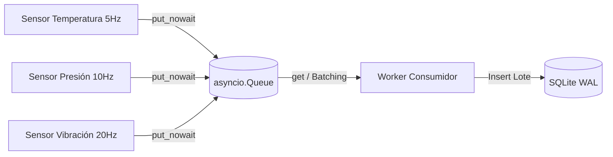
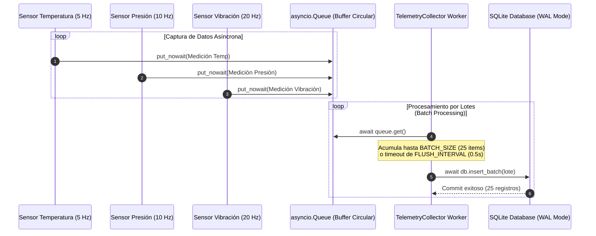

## Lenguaje de Programación Visual  
### Ingeniería Mecatrónica - FIUNA

**Semana 3: Concurrencia y Persistencia Temporal (Asyncio + SQLite)**

---

## Requisitos Previos y Configuración del Entorno

Antes de comenzar con la clase y ejecutar los ejemplos en Python o Jupyter Notebooks, asegúrese de activar el entorno virtual de la asignatura **`lpv2026-2`** e instalar las dependencias gestionadas mediante **Poetry**:

```bash
# 1. Activar el entorno virtual de la materia
conda activate lpv2026-2

# 2. Registrar el entorno virtual lpv2026-2 como Kernel en Jupyter
python -m ipykernel install --user --name lpv2026-2 --display-name "Python (lpv2026-2)"

# 3. Navegar al directorio del proyecto e instalar dependencias con Poetry
cd proyecto_sqlite_asyncio
poetry install
```

> **Nota:** Al abrir cualquier archivo Notebook (`.ipynb`) en Jupyter Notebook, JupyterLab o VS Code, seleccione el Kernel denominado **`Python (lpv2026-2)`** en la esquina superior derecha.

---

## 1. Fundamentos de Concurrencia con Asyncio

En el desarrollo de sistemas mecatrónicos modernos (robótica móvil, celdas de manufactura, adquisición de datos de sensores, controladores embebidos), la mayoría de los cuellos de botella no provienen de la capacidad de cómputo de la CPU, sino de las **operaciones de entrada/salida (I/O Bound)**: espera de bytes en bus CAN/UART, peticiones de red TCP/IP, lecturas de sensores y persistencia en almacenamiento secundario.

### 1.1 Concurrencia vs. Multiprocesamiento vs. Threading

| Modelo | Mecanismo de Control | Ámbito de Aplicación | Ventajas en Mecatrónica | Desventajas |
| --- | --- | --- | --- | --- |
| **Asyncio (Concurrencia Cooperativa)** | Event Loop monotarea sin cambio de contexto de SO. | Operaciones **I/O Bound** masivas (Red, Sensores, BD). | Consumo mínimo de memoria RAM, sin *race conditions* de hilos, escalabilidad masiva. | No aprovecha múltiples núcleos de CPU para algoritmos pesados. |
| **Threading (Hilos del SO)** | Cambio de contexto preemptivo gestionado por el SO. | Operaciones I/O concurrentes tradicionales. | API síncrona estándar de Python. | Limitado por el GIL (Global Interpreter Lock), riesgo de condiciones de carrera y *deadlocks*. |
| **Multiprocesamiento** | Procesos independientes con espacio de memoria separado. | Computación intensiva **CPU Bound** (Visión artificial, Cinemática inversa, FFT). | Paralelismo real multinúcleo en Python. | Alto overhead en creación de procesos y paso de mensajes (IPC). |

---

### 1.2 El Bucle de Eventos (Event Loop), Corrutinas y Tasks

En `asyncio`, la ejecución es gobernada por un **Event Loop** (Bucle de Eventos). El bucle de eventos gestiona una lista de tareas (*Tasks*) suspendibles llamadas **corrutinas**.

- **`async def`**: Declara una corrutina. Retorna un objeto corrutina ejecutable.
- **`await`**: Pausa la ejecución de la corrutina actual y devuelve el control al Event Loop hasta que la operación asíncrona (como `asyncio.sleep` o una lectura de red) se complete.
- **`asyncio.create_task(coro)`**: Envuelve una corrutina en un objeto `Task` y la programa para su ejecución inmediata en el bucle de eventos.
- **`asyncio.gather(*coros)`**: Espera de forma concurrente a que finalicen múltiples corrutinas o tareas y devuelve sus resultados agrupados.

```python
import asyncio
import time

async def leer_sensor_temperatura(sensor_id: str, intervalo: float):
    print(f"[{time.strftime('%H:%M:%S')}] Sensor {sensor_id}: Iniciando muestreo...")
    await asyncio.sleep(intervalo)  # Cede voluntariamente el bucle de eventos
    valor = 45.2
    print(f"[{time.strftime('%H:%M:%S')}] Sensor {sensor_id}: Lectura = {valor} °C")
    return valor

async def main():
    # Ejecución concurrente de dos sensores
    t0 = time.time()
    t1 = asyncio.create_task(leer_sensor_temperatura("S1", 1.5))
    t2 = asyncio.create_task(leer_sensor_temperatura("S2", 1.0))

    # Esperar ambas tareas
    r1 = await t1
    r2 = await t2
    print(f"Tiempo total: {time.time() - t0:.2f} segundos (Paralelo: max(1.5, 1.0) = 1.5s)")

asyncio.run(main())
```

---

### 1.3 Paso de Mensajes: `asyncio.Queue` (Productor-Consumidor)

En adquisiciones multicanal de alta frecuencia, es fundamental desacoplar el bucle de captura de sensores (Productores) del bucle de procesamiento y guardado (Consumidores/Workers). 

`asyncio.Queue` proporciona una cola FIFO (*First-In, First-Out*) asíncrona segura para la memoria compartida:



#### Propiedades Clave de `asyncio.Queue`:
- `await queue.put(item)`: Deposita un elemento. Si la cola está llena (`maxsize`), bloquea de forma asíncrona hasta que se libere espacio.
- `queue.put_nowait(item)`: Deposita un elemento sin esperar. Lanza `asyncio.QueueFull` si excede la capacidad.
- `await queue.get()`: Extrae el siguiente elemento. Si la cola está vacía, suspende la corrutina hasta que ingrese un dato.
- `queue.task_done()`: Informa a la cola que un elemento extraído ha sido completamente procesado.

---

### 1.4 Prevención de Bloqueos del Event Loop

> ⚠️ **REGLA CRÍTICA EN ASYNCIO:** Nunca llame a funciones síncronas bloqueantes (como `time.sleep()`, `requests.get()`, o librerías C de baja velocidad) directamente dentro de una corrutina `async def`, ya que congelará todo el bucle de eventos y detendrá el resto de las tareas del sistema mecatrónico.

Si es estrictamente necesario ejecutar código bloqueante síncrono, utilice `asyncio.to_thread()`:

```python
import asyncio
import time

def proceso_cpu_pesado(n: int):
    # Función síncrona bloqueante tradicional
    time.sleep(1.0)
    return sum(i * i for i in range(n))

async def main_hilo():
    # Ejecuta la función síncrona en un hilo separado del ThreadPoolExecutor
    resultado = await asyncio.to_thread(proceso_cpu_pesado, 10_000_000)
    print(f"Resultado procesado en hilo independiente: {resultado}")
```

---

## 2. Persistencia Temporal y Optimización en SQLite

En mecatrónica embebida y monitoreo industrial (*Edge Computing*), **SQLite** es el motor de base de datos relacional estándar por sus siglas **ACID**, rendimiento ligero, huella nula de servidor (*serverless*) y almacenamiento en un único archivo compacto binario.

---

### 2.1 SQLite en Sistemas Mecatrónicos Embebidos

- **Zero-Configuration**: No requiere demonios de servicio corriendo en segundo plano (ideal para Raspberry Pi, NVIDIA Jetson, Linux Embebido).
- **Fiabilidad en Apagados Repentinos**: Transacciones atómicas que previenen la corrupción de datos ante cortes imprevistos de energía en el robot o máquina industrial.
- **Portabilidad**: El archivo `.db` se puede copiar directamente entre sistemas operativos.

---

### 2.2 Modo WAL (Write-Ahead Logging) y Pragmas I/O

En la configuración estándar de SQLite (`journal_mode = DELETE`), cada operación de escritura adquiere un bloqueo exclusivo sobre todo el archivo de base de datos, bloqueando las lecturas concurrentes.

Para soportar **escrituras y lecturas concurrentes de alta velocidad**, se configura el modo **WAL (Write-Ahead Logging)**:

```sql
-- Pragmas de Optimización para Telemetría y Concurrencia
PRAGMA journal_mode = WAL;
PRAGMA synchronous = NORMAL;
PRAGMA temp_store = MEMORY;
```

#### Ventajas del Modo WAL:
1. **Concurrencia Real**: Las corrutinas de lectura pueden consultar la base de datos simultáneamente mientras los workers asíncronos escriben en el archivo WAL (`.db-wal`).
2. **Menor Sobrecarga de I/O**: Las escrituras son secuenciales en el log WAL y se consolidan en el archivo principal `.db` mediante procesos periódicos de *checkpoint*.
3. **`PRAGMA synchronous = NORMAL`**: Mantiene la durabilidad ACID ante fallos de aplicación y reduce drásticamente las llamadas síncronas `fsync()` de disco.

---

### 2.3 SQLite Síncrono (`sqlite3`) vs. Asíncrono (`aiosqlite`)

| Característica | `sqlite3` (Librería Estándar) | `aiosqlite` (Driver Asíncrono) |
| --- | --- | --- |
| **Naturaleza I/O** | Bloqueante (Síncrono). | No bloqueante (Asíncrono con Event Loop). |
| **Integración con `asyncio`** | Requiere wrappers manuales con hilos (`asyncio.to_thread`). | Integración nativa con `await` en `connect()`, `execute()`, `commit()`. |
| **Uso Recomendado** | Scripts de mantenimiento síncronos, procesamiento batch diferido. | Pipelines de adquisición en tiempo real, APIs REST web, Dashboards. |

#### Ejemplo con `aiosqlite`:
```python
import aiosqlite

async def guardar_telemetria():
    async with aiosqlite.connect("telemetria.db") as db:
        await db.execute("PRAGMA journal_mode = WAL;")
        await db.execute("""
            CREATE TABLE IF NOT EXISTS mediciones (
                id INTEGER PRIMARY KEY AUTOINCREMENT,
                timestamp DATETIME,
                sensor TEXT,
                valor REAL
            );
        """)
        await db.execute(
            "INSERT INTO mediciones (timestamp, sensor, valor) VALUES (?, ?, ?);",
            ("2026-08-13 10:00:00", "TEMP_MOTOR", 65.4)
        )
        await db.commit()
```

---

### 2.4 Modelado e Indexación de Series Temporales

En telemetría, las consultas más comunes buscan datos de un sensor específico dentro de un **rango de tiempo** determinado. La creación de índices compuestos en SQLite es vital para mantener tiempos de consulta en orden $O(\log N)$:

```sql
-- Tabla principal de telemetría
CREATE TABLE IF NOT EXISTS lecturas_telemetria (
    id INTEGER PRIMARY KEY AUTOINCREMENT,
    timestamp DATETIME NOT NULL,
    timestamp_unix REAL NOT NULL,
    sensor_id TEXT NOT NULL,
    tipo_sensor TEXT NOT NULL,
    valor REAL NOT NULL,
    unidad TEXT NOT NULL
);

-- Índice compuesto por ID de Sensor y Marca de Tiempo Unix
CREATE INDEX IF NOT EXISTS idx_sensor_time 
ON lecturas_telemetria (sensor_id, timestamp_unix);

-- Índice global por marca de tiempo para búsquedas en ventana temporal
CREATE INDEX IF NOT EXISTS idx_timestamp 
ON lecturas_telemetria (timestamp_unix);
```

---

## 3. Arquitectura Integrada del Sistema de Telemetría

A continuación se muestra el esquema del sistema mecatrónico desarrollado en la práctica:



---

## 4. Estructura del Proyecto y Contenido Didáctico

El material de esta semana está organizado en dos componentes principales: un **Jupyter Notebook interactivo** para la exploración guiada y un **Proyecto Python Modular** listo para producción administrado con **Poetry**.

```
d:\Materiales de Auxiliar\1. Lenguaje de Programacion Visual\
├── README.md                              # Documentación principal de la materia
├── notebook_semana3_asyncio_sqlite.ipynb  # Notebook interactivo teórico-práctico
└── proyecto_sqlite_asyncio/               # Proyecto Python modular equivalente
    ├── README.md                          # Guía específica del proyecto con Poetry
    ├── pyproject.toml                     # Configuración y dependencias administradas con Poetry
    ├── main.py                            # Punto de entrada (Simulación interactiva)
    ├── config/
    │   └── settings.py                    # Configuración de sensores, paths y batching
    ├── src/
    │   ├── __init__.py
    │   ├── database.py                    # Gestor asíncrono aiosqlite (WAL mode, batching)
    │   ├── sensors.py                     # Corrutinas generadoras de sensores mecatrónicos
    │   ├── collector.py                   # Worker Productor-Consumidor con asyncio.Queue
    │   └── utils.py                       # Formateo de tablas y reportes estadísticos
    ├── data/
    │   └── .gitkeep                       # Almacenamiento local del archivo SQLite .db
    └── tests/
        ├── __init__.py
        └── test_telemetry.py              # Pruebas unitarias asíncronas con pytest-asyncio
```

### Enlaces Directos a los Componentes:

- 📓 **Jupyter Notebook Práctico:** [notebook_semana3_asyncio_sqlite.ipynb](file:///d:/Materiales%20de%20Auxiliar/1.%20Lenguaje%20de%20Programacion%20Visual/notebook_semana3_asyncio_sqlite.ipynb)
- ⚙️ **Configuración Poetry:** [proyecto_sqlite_asyncio/pyproject.toml](file:///d:/Materiales%20de%20Auxiliar/1.%20Lenguaje%20de%20Programacion%20Visual/proyecto_sqlite_asyncio/pyproject.toml)
- 🚀 **Proyecto Python Modular:** [proyecto_sqlite_asyncio/](file:///d:/Materiales%20de%20Auxiliar/1.%20Lenguaje%20de%20Programacion%20Visual/proyecto_sqlite_asyncio)
  - [main.py](file:///d:/Materiales%20de%20Auxiliar/1.%20Lenguaje%20de%20Programacion%20Visual/proyecto_sqlite_asyncio/main.py)
  - [config/settings.py](file:///d:/Materiales%20de%20Auxiliar/1.%20Lenguaje%20de%20Programacion%20Visual/proyecto_sqlite_asyncio/config/settings.py)
  - [src/database.py](file:///d:/Materiales%20de%20Auxiliar/1.%20Lenguaje%20de%20Programacion%20Visual/proyecto_sqlite_asyncio/src/database.py)
  - [src/sensors.py](file:///d:/Materiales%20de%20Auxiliar/1.%20Lenguaje%20de%20Programacion%20Visual/proyecto_sqlite_asyncio/src/sensors.py)
  - [src/collector.py](file:///d:/Materiales%20de%20Auxiliar/1.%20Lenguaje%20de%20Programacion%20Visual/proyecto_sqlite_asyncio/src/collector.py)
  - [src/utils.py](file:///d:/Materiales%20de%20Auxiliar/1.%20Lenguaje%20de%20Programacion%20Visual/proyecto_sqlite_asyncio/src/utils.py)
  - [tests/test_telemetry.py](file:///d:/Materiales%20de%20Auxiliar/1.%20Lenguaje%20de%20Programacion%20Visual/proyecto_sqlite_asyncio/tests/test_telemetry.py)

---

## 5. Guía de Ejecución y Pruebas Unitarias

### 1. Apertura y Ejecución del Notebook
Abra Jupyter Lab o VS Code en el directorio de la materia y seleccione el Kernel **`Python (lpv2026-2)`** para ejecutar [notebook_semana3_asyncio_sqlite.ipynb](file:///d:/Materiales%20de%20Auxiliar/1.%20Lenguaje%20de%20Programacion%20Visual/notebook_semana3_asyncio_sqlite.ipynb).

### 2. Instalación y Ejecución con Poetry
Asegúrese de tener activo el entorno **`lpv2026-2`** y ejecute:

```bash
# Activar entorno virtual
conda activate lpv2026-2

# Entrar al directorio del proyecto e instalar dependencias con Poetry
cd proyecto_sqlite_asyncio
poetry install

# Ejecutar la simulación principal
poetry run python main.py
```

#### Salida esperada en consola:
```text
11:46:10 [INFO] Main: === INICIANDO SISTEMA DE TELEMETRÍA MECATRÓNICA (ASYNCIO + SQLITE) ===
11:46:10 [INFO] TelemetryDB: Conexión a SQLite establecida (WAL mode activo) en: telemetry_mechatronics.db
11:46:10 [INFO] AsyncSensors: Sensor [TEMP_MOTOR_01] iniciado a 5.0 Hz.
11:46:10 [INFO] AsyncSensors: Sensor [PRES_HIDRAULICA_01] iniciado a 10.0 Hz.
11:46:10 [INFO] AsyncSensors: Sensor [VIB_ROBOT_AXIS3] iniciado a 20.0 Hz.
11:46:10 [INFO] TelemetryCollector: Worker de persistencia SQLite iniciado.
...
11:46:16 [INFO] TelemetryCollector: Worker de persistencia SQLite finalizado. Total registros insertados: 211

================================================================================
           RESUMEN ESTADÍSTICO DE TELEMETRÍA PERSISTIDA EN SQLITE
================================================================================
+--------------------+------------+----------+------------+------------+----------+----------+
| Sensor ID          | Tipo       | Unidad   |   Lecturas |   Promedio |   Mínimo |   Máximo |
+====================+============+==========+============+============+==========+==========+
| PRES_HIDRAULICA_01 | Presion    | bar      |         60 |    148.093 |  144.116 |  152.029 |
+--------------------+------------+----------+------------+------------+----------+----------+
| TEMP_MOTOR_01      | Temperatura| °C       |         30 |     65.918 |   64.137 |   67.575 |
+--------------------+------------+----------+------------+------------+----------+----------+
| VIB_ROBOT_AXIS3    | Vibracion  | m/s²     |        121 |      1.666 |    1.399 |    1.905 |
+--------------------+------------+----------+------------+------------+----------+----------+
```

### 3. Ejecución de Pruebas Unitarias y Asíncronas
El proyecto incluye pruebas automatizadas con `pytest` y `pytest-asyncio` ejecutadas mediante Poetry:

```bash
cd proyecto_sqlite_asyncio
poetry run pytest tests/
```

---
*Facultad de Ingeniería - Universidad Nacional de Asunción (FIUNA)*
