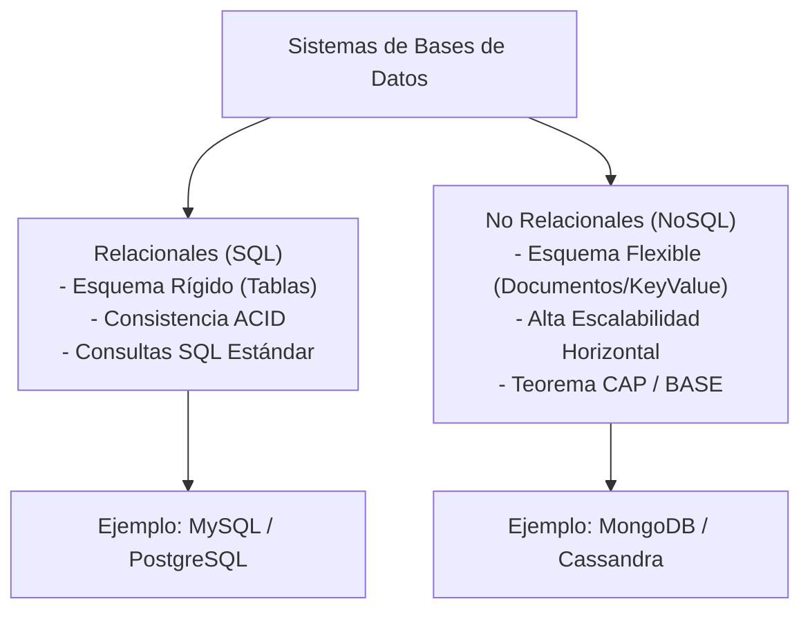
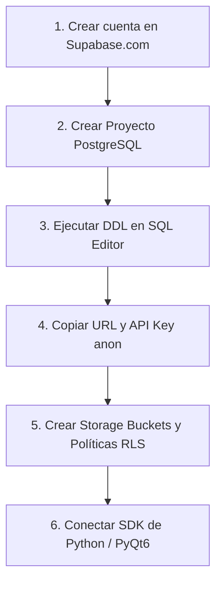

## Lenguaje de Programación Visual  
### Ingeniería Mecatrónica - FIUNA

**Semana 3: Concurrencia y Persistencia Temporal (Asyncio + SQLite)**

---

## 1. Bases de Datos Relacionales (SQL) vs. No Relacionales (NoSQL)

Las bases de datos son el pilar fundamental para almacenar, organizar y consultar información en sistemas de software. Dependiendo de la estructura de los datos, los requerimientos de escalabilidad y la consistencia necesaria, se dividen principalmente en dos grandes paradigmas: **Bases de Datos Relacionales (SQL)** y **Bases de Datos No Relacionales (NoSQL)**.



### 1.1 Comparativa Técnica y Arquitectónica

| Característica | Bases de Datos Relacionales (SQL) | Bases de Datos No Relacionales (NoSQL) |
| :--- | :--- | :--- |
| **Estructura de Datos** | Organizada en **tablas** con filas (registros) y columnas (campos). | Organizada en **documentos (JSON/BSON)**, clave-valor, grafos o columnas anchas. |
| **Esquema (*Schema*)** | **Rígido y predefinido** (*Schema-on-Write*). Cada fila debe respetar el tipo de dato de la columna. | **Dinámico y flexible** (*Schema-on-Read*). Cada documento puede tener campos distintos. |
| **Relaciones e Integridad** | Soporta claves primarias, claves foráneas e integridad referencial estricta (`JOINs`). | Relaciones generalmente denormalizadas (documentos embebidos o referencias simples). |
| **Garantías de Transacción** | Propiedades **ACID** (*Atomicity, Consistency, Isolation, Durability*). | Teorema CAP / Filosofía **BASE** (*Basic Availability, Soft-state, Eventual consistency*). |
| **Escalabilidad** | Principalmente **Vertical** (aumentar CPU, RAM o disco del servidor). | Principalmente **Horizontal** (*Sharding* o particionado entre múltiples servidores). |
| **Lenguaje de Consulta** | Estándar declarativo **SQL** (*Structured Query Language*). | APIs orientadas a objetos, métodos de drivers o lenguajes sintácticos específicos (MQL). |

---

### 1.2 Ejemplo de Base de Datos Relacional: MySQL

En MySQL (y en cualquier RDBMS SQL), los datos deben modelarse previamente definiendo tablas y sus tipos de datos exactos:

```sql
-- 1. Crear la tabla 'estudiantes' con esquema estricto
CREATE TABLE estudiantes (
    id INT UNSIGNED AUTO_INCREMENT PRIMARY KEY,
    nombre VARCHAR(50) NOT NULL,
    carrera VARCHAR(50) NOT NULL,
    semestre TINYINT UNSIGNED NOT NULL,
    creado_en TIMESTAMP DEFAULT CURRENT_TIMESTAMP
);

-- 2. Crear la tabla 'calificaciones' vinculada con Clave Foránea (FK)
CREATE TABLE calificaciones (
    id INT UNSIGNED AUTO_INCREMENT PRIMARY KEY,
    estudiante_id INT UNSIGNED NOT NULL,
    materia VARCHAR(50) NOT NULL,
    nota DECIMAL(4,2) NOT NULL,
    FOREIGN KEY (estudiante_id) REFERENCES estudiantes(id) ON DELETE CASCADE
);

-- 3. Inserción de datos respetando la estructura
INSERT INTO estudiantes (nombre, carrera, semestre) VALUES ('Carlos Benitez', 'Mecatrónica', 6);
INSERT INTO calificaciones (estudiante_id, materia, nota) VALUES (1, 'Lenguaje de Programación Visual', 5.00);

-- 4. Consulta relacional combinando tablas mediante JOIN
SELECT e.nombre, e.carrera, c.materia, c.nota
FROM estudiantes AS e
INNER JOIN calificaciones AS c ON e.id = c.estudiante_id;
```

---

### 1.3 Ejemplo de Base de Datos No Relacional: MongoDB

En MongoDB, los datos se almacenan como documentos BSON (similares a objetos JSON). No existe la necesidad de definir tablas previa ni estandarizar todos los campos:

```javascript
// 1. Inserción de un documento en la colección 'estudiantes'
db.estudiantes.insertOne({
    nombre: "Carlos Benitez",
    carrera: "Mecatrónica",
    semestre: 6,
    materias_aprobadas: ["Física III", "Electrónica Digital"],
    contacto: {
        email: "cbenitez@fiuna.edu.py",
        telefono: "+595981000000"
    },
    creado_en: new Date()
});

// 2. Inserción de un segundo documento con estructura DIFERENTE (esquema flexible)
db.estudiantes.insertOne({
    nombre: "María García",
    carrera: "Mecatrónica",
    semestre: 4,
    proyecto_investigacion: "Robótica Móvil Autónoma", // Campo único no presente en el registro anterior
    procedencia: "Asunción"
});

// 3. Consulta de documentos con filtrado directo en JSON
db.estudiantes.find({ carrera: "Mecatrónica", semestre: { $gte: 4 } });
```

---

## 2. Manual Completo de SQL

*Basado en la guía oficial **MySQL Ya desde CERO***.

El lenguaje **SQL** (*Structured Query Language*) es el estándar universal de consulta y gestión de bases de datos relacionales. A continuación se presentan las secciones fundamentales y funciones esenciales de SQL.

---

### 2.1 Estructura y Comandos DDL (Data Definition Language)

El DDL permite definir, modificar y destruir estructuras de la base de datos (bases de datos, tablas, índices).

#### Administración de Bases de Datos y Tablas
```sql
SHOW DATABASES;                     -- Lista las bases de datos en el servidor
CREATE DATABASE mecatronica_db;     -- Crea una nueva base de datos
USE mecatronica_db;                 -- Selecciona la base de datos activa
SHOW TABLES;                        -- Lista las tablas existentes en la BD
DESCRIBE estudiantes;               -- Muestra el esquema de la tabla (columnas, tipos, nulos, llaves)
```

#### Creación de Tablas (`CREATE TABLE`)
```sql
CREATE TABLE usuarios (
    nombre VARCHAR(30),
    clave VARCHAR(10)
);
```

#### Modificación de Estructuras (`ALTER TABLE`)
* **Agregar columnas:**
  ```sql
  ALTER TABLE libros ADD cantidad SMALLINT UNSIGNED NOT NULL;
  ALTER TABLE libros ADD edicion DATE AFTER autor;
  ```
* **Eliminar columnas:**
  ```sql
  ALTER TABLE libros DROP COLUMN edicion;
  ```
* **Modificar tipo de dato o atributos de una columna:**
  ```sql
  ALTER TABLE libros MODIFY titulo VARCHAR(60) NOT NULL;
  ```
* **Cambiar nombre y tipo de una columna (`CHANGE`):**
  ```sql
  ALTER TABLE libros CHANGE costo precio DECIMAL(5,2) UNSIGNED;
  ```
* **Renombrar una tabla:**
  ```sql
  ALTER TABLE usuarios RENAME clientes;
  -- O sintaxis equivalente:
  RENAME TABLE usuarios TO clientes;
  ```

#### Eliminación y Vaciado de Tablas
```sql
DROP TABLE libros;                  -- Elimina la tabla y todos sus datos permanentemente
DROP TABLE IF EXISTS libros;        -- Elimina la tabla solo si existe evitando errores
TRUNCATE TABLE libros;              -- Vacía todos los registros y reinicia contadores AUTO_INCREMENT a 1
```

---

### 2.2 Tipos de Datos en SQL

SQL requiere la definición precisa del tipo de dato de cada columna para optimizar almacenamiento y garantizar integridad.

| Categoría | Tipo de Dato | Rango / Capacidad | Descripción |
| :--- | :--- | :--- | :--- |
| **Cadenas** | `VARCHAR(n)` | 1 a 255 (o más) caracteres | Longitud variable. Almacena solo los caracteres usados + 1 byte de tamaño. |
| | `CHAR(n)` | 1 a 255 caracteres | Longitud fija. Rellena a la derecha con espacios si la cadena es más corta. |
| | `TEXT` | Hasta ~65,535 caracteres | Texto extenso para sinopsis, artículos o logs. |
| | `BLOB` | Hasta ~65,535 bytes | Datos binarios (imágenes, ejecutables, archivos). |
| | `ENUM('v1','v2',...)` | Hasta 65,535 lista de opciones | Enumeración. Almacena solo **un valor** de la lista predefinida. |
| | `SET('v1','v2',...)` | Hasta 64 miembros | Permite guardar **múltiples opciones** de la lista elegible separadas por comas. |
| **Numéricos** | `TINYINT` | -128 a 127 (o 0 a 255 `UNSIGNED`) | Entero de 1 byte. |
| | `SMALLINT` | -32,768 a 32,767 (o 0 a 65,535 `UNSIGNED`) | Entero de 2 bytes. |
| | `MEDIUMINT` | -8.3M a 8.3M (o 0 a 16.7M `UNSIGNED`) | Entero de 3 bytes. |
| | `INT` / `INTEGER` | -2.14B a 2.14B (o 0 a 4.29B `UNSIGNED`) | Entero estándar de 4 bytes. |
| | `BIGINT` | $\approx \pm 9 \times 10^{18}$ | Entero de 8 bytes para IDs de gran volumen. |
| | `FLOAT(t, d)` | Coma flotante de precisión simple | Numérico aproximado. |
| | `DECIMAL(t, d)` | Exactitud fija ($t=$ dígitos, $d=$ decimales) | Recomendado para moneda y medidas físicas exactas (ej. `DECIMAL(6,2)`). |
| **Fechas** | `DATE` | `YYYY-MM-DD` | Fecha sin componente de tiempo. |
| | `DATETIME` | `YYYY-MM-DD HH:MM:SS` | Fecha y hora estándar. |
| | `TIME` | `HH:MM:SS` | Horas o intervalos de tiempo. |
| | `YEAR` | `YYYY` o `YY` | Representación de año. |
| | `TIMESTAMP` | Estampa temporal UTC | Se actualiza automáticamente al modificar el registro. |

#### Atributos de Columna
* **`UNSIGNED`**: Prohíbe números negativos y duplica el rango positivo.
* **`ZEROFILL`**: Rellena con ceros a la izquierda hasta completar la longitud declarada (ej. `INT(4) ZEROFILL` muestra `0005`).
* **`AUTO_INCREMENT`**: Genera un número correlativo automático para cada nueva fila.
* **`NOT NULL` / `NULL`**: Declara la obligatoriedad u optatividad del dato.
* **`DEFAULT`**: Asigna un valor por defecto en caso de omitirlo durante la inserción.

---

### 2.3 Manipulación de Datos DML (Data Manipulation Language)

#### Inserción de Datos (`INSERT INTO`)
```sql
-- Inserción explícita especificando campos
INSERT INTO usuarios (nombre, clave) VALUES ('MarioPerez', 'Marito');

-- Inserción utilizando valores por defecto
INSERT INTO libros (titulo, autor, precio) VALUES ('El Aleph', DEFAULT, 25.50);

-- Inserción masiva desde subconsulta
INSERT INTO editoriales (nombre) SELECT DISTINCT editorial FROM libros WHERE editorial IS NOT NULL;
```

#### Reemplazo de Registros (`REPLACE INTO`)
Elimina el registro existente e inserta uno nuevo si encuentra un duplicado en la clave primaria o en un índice único:
```sql
REPLACE INTO libros (codigo, titulo, autor, precio) VALUES (23, 'Java en 10 Minutos', 'Mario Molina', 30.00);
```

#### Consultas (`SELECT`)
```sql
SELECT titulo, precio, cantidad, (precio * cantidad) AS total_inventario FROM libros;
```

#### Actualización (`UPDATE`)
```sql
UPDATE libros SET precio = 45.00, cantidad = 20 WHERE codigo = 10;
```

#### Eliminación (`DELETE`)
```sql
DELETE FROM libros WHERE autor = 'Borges';
DELETE FROM libros ORDER BY precio ASC LIMIT 2; -- Elimina los 2 libros más baratos
```

---

### 2.4 Filtrado, Operadores Lógicos y Búsquedas

#### Operadores Relacionales y Lógicos
* **Relacionales:** `=`, `<>`, `<`, `>`, `<=`, `>=`.
* **Lógicos:** `AND`, `OR`, `NOT`, `XOR`.

```sql
SELECT * FROM libros WHERE (autor = 'Borges' OR editorial = 'Planeta') AND NOT (precio > 50);
```

#### Operadores de Rango, Conjuntos y Nulos
* **`BETWEEN min AND max`**: Filtra en un rango inclusivo.
  ```sql
  SELECT * FROM libros WHERE precio BETWEEN 15.00 AND 35.00;
  ```
* **`IN (v1, v2, ...)`**: Evalúa coincidencia con una lista de valores.
  ```sql
  SELECT * FROM libros WHERE autor IN ('Borges', 'Paenza', 'Cortazar');
  ```
* **`IS NULL` / `IS NOT NULL`**: Evalúa si un valor es nulo.
  ```sql
  SELECT * FROM libros WHERE precio IS NULL;
  ```

#### Búsqueda por Patrones (`LIKE` y `REGEXP`)
* **`LIKE`**:
  * `%`: Representa 0 o varios caracteres.
  * `_`: Representa exactamente 1 carácter.
  ```sql
  SELECT * FROM libros WHERE autor LIKE '%Borges%';
  SELECT * FROM libros WHERE autor LIKE 'Carrol_';
  ```
* **Expresiones Regulares (`REGEXP`)**:
  ```sql
  SELECT * FROM libros WHERE titulo REGEXP '^A';      -- Comienza con A
  SELECT * FROM libros WHERE titulo REGEXP 'HP$';     -- Termina con HP
  SELECT * FROM libros WHERE autor REGEXP '[hk]';     -- Contiene 'h' o 'k'
  ```

---

### 2.5 Ordenamiento, Duplicados y Paginación

#### Ordenamiento (`ORDER BY`)
```sql
SELECT * FROM libros ORDER BY titulo ASC, precio DESC;
```

#### Eliminación de Duplicados (`DISTINCT`)
```sql
SELECT DISTINCT autor FROM libros WHERE autor IS NOT NULL;
```

#### Paginación (`LIMIT`)
```sql
SELECT * FROM libros ORDER BY codigo LIMIT 0, 5; -- Devuelve las primeras 5 filas (Offset 0)
SELECT * FROM libros ORDER BY codigo LIMIT 5, 5; -- Devuelve las siguientes 5 filas (Offset 5)
```

#### Orden Aleatorio
```sql
SELECT * FROM libros ORDER BY RAND() LIMIT 3;
```

---

### 2.6 Funciones Integradas en SQL

#### Funciones de Agregación y Agrupamiento (`GROUP BY` / `HAVING`)
* `COUNT(*)`, `COUNT(campo)`, `SUM(campo)`, `AVG(campo)`, `MAX(campo)`, `MIN(campo)`.

```sql
SELECT editorial, COUNT(*) AS total_libros, AVG(precio) AS promedio_precio
FROM libros
WHERE precio IS NOT NULL
GROUP BY editorial
HAVING AVG(precio) > 20.00;
```
> **Nota:** `WHERE` filtra filas antes de agrupar; `HAVING` filtra grupos después de calcular agregaciones.

#### Funciones para Cadenas de Texto
* `CONCAT(c1, c2, ...)` / `CONCAT_WS(sep, c1, c2, ...)`: Concatena texto.
* `LENGTH(cadena)`: Devuelve la cantidad de caracteres.
* `SUBSTRING(cadena, pos, lon)` / `MID(...)`: Extrae subcadena.
* `LEFT(cadena, n)` / `RIGHT(cadena, n)`: Retorna *n* caracteres desde el inicio o fin.
* `TRIM(cadena)` / `LTRIM(...)` / `RTRIM(...)`: Elimina espacios en blanco.
* `REPLACE(cadena, buscar, reemplazar)`: Reemplaza coincidencias de texto.
* `UPPER(cadena)` / `LOWER(cadena)`: Convierte a mayúsculas o minúsculas.
* `POSITION(sub IN cadena)` / `INSTR(cadena, sub)`: Retorna la posición de una subcadena.
* `LPAD(cadena, lon, rel)` / `RPAD(...)`: Rellena caracteres a la izquierda o derecha.
* `REVERSE(cadena)`: Invierte la cadena.
* `STRCMP(c1, c2)`: Compara dos cadenas ($0$ si son iguales, $-1$ si $c1 < c2$, $1$ si $c1 > c2$).

#### Funciones Matemáticas
* `ABS(x)`: Valor absoluto.
* `CEILING(x)`: Redondeo entero hacia arriba.
* `FLOOR(x)`: Redondeo entero hacia abajo.
* `MOD(n, m)` / `%`: Resto de la división.
* `POWER(x, y)`: Potencia $x^y$.
* `ROUND(x, d)`: Redondeo a $d$ decimales.
* `SQRT(x)`: Raíz cuadrada.
* `TRUNCATE(x, d)`: Trunca sin redondear a $d$ decimales.
* `RAND()`: Genera número aleatorio flotante entre 0.0 y 1.0.

#### Funciones de Fecha y Hora
* `NOW()` / `CURRENT_TIMESTAMP()`: Fecha y hora actual del servidor.
* `CURRENT_DATE()` / `CURRENT_TIME()`: Fecha o hora actual.
* `DATEDIFF(f1, f2)`: Resta de días entre dos fechas.
* `DATE_ADD(fecha, INTERVAL n UNIDAD)` / `DATE_SUB(...)`: Suma o resta intervalos.
* `EXTRACT(UNIDAD FROM fecha)`: Extrae `YEAR`, `MONTH`, `DAY`, `HOUR`, `MINUTE`, `SECOND`.
* `DAYNAME(fecha)` / `MONTHNAME(fecha)`: Nombre del día o mes en texto.

#### Control de Flujo (`IF` y `CASE`)
* **Función `IF`:**
  ```sql
  SELECT titulo, IF(precio > 50, 'Costoso', 'Accesible') AS tipo_precio FROM libros;
  ```
* **Estructura `CASE`:**
  ```sql
  SELECT editorial,
         CASE COUNT(*)
             WHEN 1 THEN 'Un solo libro'
             WHEN 2 THEN 'Dos libros'
             ELSE 'Múltiples libros'
         END AS cantidad_evaluada
  FROM libros GROUP BY editorial;
  ```

#### Encriptación y Seguridad
```sql
-- Encriptar y desencriptar mediante clave privada
INSERT INTO usuarios VALUES ('MarioPerez', ENCODE('MiClaveAcceso', 'secreto123'));
SELECT DECODE(clave, 'secreto123') FROM usuarios WHERE nombre = 'MarioPerez';
```

---

### 2.7 Claves, Índices y Relaciones

#### Clave Primaria (`PRIMARY KEY`)
* **Simple:**
  ```sql
  CREATE TABLE libros (
      codigo INT UNSIGNED AUTO_INCREMENT PRIMARY KEY,
      titulo VARCHAR(50) NOT NULL
  );
  ```
* **Compuesta (Multicampo):**
  ```sql
  CREATE TABLE estacionamiento (
      patente CHAR(6) NOT NULL,
      hora_ingreso TIME NOT NULL,
      tipo_vehiculo VARCHAR(20),
      PRIMARY KEY (patente, hora_ingreso)
  );
  ```

#### Clave Foránea (`FOREIGN KEY`)
```sql
CREATE TABLE libros (
    codigo INT UNSIGNED AUTO_INCREMENT PRIMARY KEY,
    titulo VARCHAR(50) NOT NULL,
    codigo_editorial TINYINT UNSIGNED,
    FOREIGN KEY (codigo_editorial) REFERENCES editoriales(codigo) ON DELETE CASCADE
);
```

#### Índices (`INDEX` / `UNIQUE`)
Acelera significativamente la velocidad de búsqueda de registros en consultas grandes.
```sql
CREATE INDEX idx_editorial ON libros(editorial);
CREATE UNIQUE INDEX idx_titulo_editorial ON libros(titulo, editorial);
DROP INDEX idx_editorial ON libros;
```

---

### 2.8 Consultas Multitabla (JOINS)

Combina registros de múltiples tablas conectadas por relaciones.

#### Tipos de JOINS
* **`INNER JOIN`**: Retorna únicamente filas que tengan coincidencia exacta en ambas tablas.
  ```sql
  SELECT l.titulo, l.autor, e.nombre AS editorial
  FROM libros AS l
  INNER JOIN editoriales AS e ON l.codigo_editorial = e.codigo;
  ```
* **`LEFT JOIN`**: Retorna todas las filas de la tabla izquierda y las coincidentes de la derecha (`NULL` si no hay relación).
  ```sql
  SELECT e.nombre AS editorial, l.titulo
  FROM editoriales AS e
  LEFT JOIN libros AS l ON e.codigo = l.codigo_editorial;
  ```
* **`RIGHT JOIN`**: Retorna todas las filas de la tabla derecha y las coincidentes de la izquierda.
  ```sql
  SELECT e.nombre AS editorial, l.titulo
  FROM libros AS l
  RIGHT JOIN editoriales AS e ON l.codigo_editorial = e.codigo;
  ```
* **`CROSS JOIN`**: Genera el producto cartesiano de todas las filas.
  ```sql
  SELECT c.nombre AS comida, p.nombre AS postre FROM comidas AS c CROSS JOIN postres AS p;
  ```
* **`NATURAL JOIN`**: Une automáticamente columnas que posean exactamente el mismo nombre en ambas tablas.
  ```sql
  SELECT l.titulo, e.nombre FROM libros AS l NATURAL JOIN editoriales AS e;
  ```

#### Sentencias `UPDATE` y `DELETE` con `JOIN`
```sql
-- Actualizar campos basándose en otra tabla
UPDATE libros AS l
JOIN editoriales AS e ON l.codigo_editorial = e.codigo
SET l.editorial_nombre = e.nombre;

-- Eliminar filas basadas en coincidencia multitabla
DELETE l FROM libros AS l
JOIN editoriales AS e ON l.codigo_editorial = e.codigo
WHERE e.nombre = 'Emece';
```

---

### 2.9 Variables de Usuario y Mantenimiento de Tablas

```sql
-- Variables de Usuario en la Sesión
SELECT @max_precio := MAX(precio) FROM libros;
SELECT * FROM libros WHERE precio = @max_precio;

-- Diagnóstico y Reparación
CHECK TABLE libros;         -- Verifica la integridad de la tabla física
REPAIR TABLE libros;        -- Repara tablas corruptas
```

---

## 3. Guía de Creación y Configuración de Proyectos en Supabase

**Supabase** es un Backend-as-a-Service (BaaS) *open-source* basado en la potencia de **PostgreSQL**. Ofrece autenticación, base de datos en tiempo real, almacenamiento de archivos (*Storage*) y APIs auto-generadas.



### Paso 1: Crear Cuenta y Proyecto en Supabase
1. Ingrese a [https://supabase.com](https://supabase.com) y cree una cuenta (preferentemente vinculando **GitHub**).
2. En el panel principal, haga clic en **New Project**.
3. Seleccione su **Organization**, ingrese un **Name** (ej. `solar-srs-db`), establezca una **Database Password** segura y seleccione la región geográfica más cercana.
4. Seleccione el plan **Free Tier** y haga clic en **Create New Project**.

### Paso 2: Crear Esquema y Tablas en SQL Editor
1. Dentro del panel del proyecto, diríjase al **SQL Editor** en el menú izquierdo.
2. Haga clic en **New Query**, pegue el script DDL de su proyecto y presione **Run**. Ejemplo:

```sql
-- Extensión de criptografía para UUIDs
CREATE EXTENSION IF NOT EXISTS pgcrypto;

-- Tabla de Datasets
CREATE TABLE IF NOT EXISTS public.datasets (
    id UUID PRIMARY KEY DEFAULT gen_random_uuid(),
    name TEXT NOT NULL,
    version TEXT NOT NULL,
    description TEXT,
    created_at TIMESTAMPTZ NOT NULL DEFAULT NOW(),
    UNIQUE(name, version)
);

-- Tabla de manchas solares
CREATE TABLE IF NOT EXISTS public.sunspot_crops (
    id UUID PRIMARY KEY DEFAULT gen_random_uuid(),
    dataset_id UUID NOT NULL REFERENCES public.datasets(id) ON DELETE CASCADE,
    crop_filename TEXT NOT NULL,
    mcintosh_full TEXT,
    noaa BIGINT,
    created_at TIMESTAMPTZ NOT NULL DEFAULT NOW()
);
```

### Paso 3: Copiar Credenciales API y Variables de Entorno (`.env`)
1. Vaya a ⚙️ **Project Settings** > **API**.
2. Copie el **Project URL** (`https://<project-id>.supabase.co`) y el **Project API Key (`anon` `public`)**.
3. En la raíz de su proyecto cliente (Python/Node), cree un archivo `.env`:

```env
SUPABASE_URL=https://xxxxxxxxxxxxxxxxxxxx.supabase.co
SUPABASE_KEY=eyJhbGciOiJIUzI1NiIsInR5cCI6IkpXVCJ9...
```

### Paso 4: Crear Storage Buckets y Configurar RLS (Row Level Security)
1. En la sección 📁 **Storage**, cree un nuevo Bucket (ej. `sunspots`) marcándolo como público o privado según sus requisitos.
2. En el **SQL Editor**, configure las políticas RLS para habilitar lectura/escritura pública con la clave `anon`:

```sql
-- Habilitar RLS en la tabla
ALTER TABLE public.sunspot_crops ENABLE ROW LEVEL SECURITY;

-- Política de Lectura Pública (SELECT)
CREATE POLICY "Lectura Publica" ON public.sunspot_crops FOR SELECT USING (true);

-- Política de Inserción Pública (INSERT)
CREATE POLICY "Insercion Publica" ON public.sunspot_crops FOR INSERT WITH CHECK (true);
```

### Paso 5: Conexión del Cliente en Python
Instale la librería cliente e integre Supabase en su código:

```bash
pip install supabase python-dotenv
```

```python
import os
from dotenv import load_dotenv
from supabase import create_client, Client

load_dotenv()
supabase: Client = create_client(os.getenv("SUPABASE_URL"), os.getenv("SUPABASE_KEY"))

# Consulta SELECT
res = supabase.table("sunspot_crops").select("*").limit(5).execute()
print("Datos recibidos:", res.data)
```

---

## 4. Ejemplos y Proyectos del Repositorio

En esta sección se presentan las aplicaciones prácticas desarrolladas en la asignatura. Cada una cuenta con su documentación técnica completa en su respectivo directorio:

### [Proyecto 1: Concurrencia y Persistencia Temporal (Asyncio + SQLite)](proyecto_sqlite_asyncio/README.md)
* **Descripción:** Implementación de adquisición concurrente masiva de sensores I/O Bound utilizando corrutinas de `asyncio`, desacoplamiento mediante colas seguro-asíncronas (`asyncio.Queue` bajo patrón Productor-Consumidor) y persistencia relacional en tiempo real sobre **SQLite** con modo de transmisión WAL (*Write-Ahead Logging*).
* **Documentación completa:** 📖 [Ver README de Asyncio + SQLite](proyecto_sqlite_asyncio/README.md)

---

### [Proyecto 2: Visualizador GUI e Integración Cloud (PyQt6 + Supabase)](proyectoPyQT6_supabase/README.md)
* **Descripción:** Aplicación gráfica de escritorio desarrollada en **PyQt6** integrada con el servicio cloud de **Supabase** (PostgreSQL). Permite visualizar interactivamente imágenes y metadatos de manchas solares clasificadas bajo la escala Zurich-McIntosh a partir de datasets de la NOAA, permitiendo además el registro de nuevas observaciones.
* **Documentación completa:** 📖 [Ver README de PyQt6 + Supabase](proyectoPyQT6_supabase/README.md)
