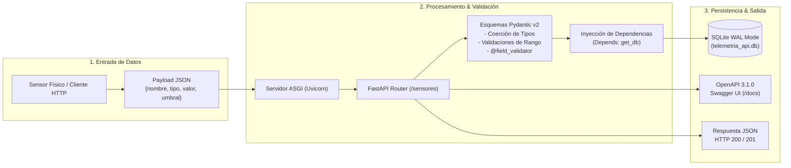
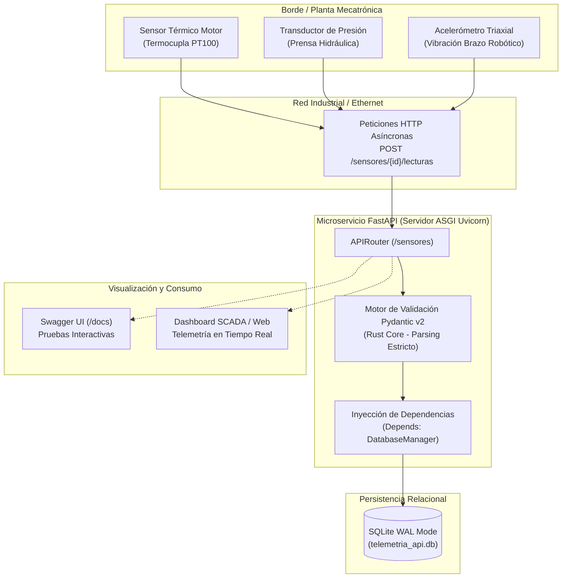
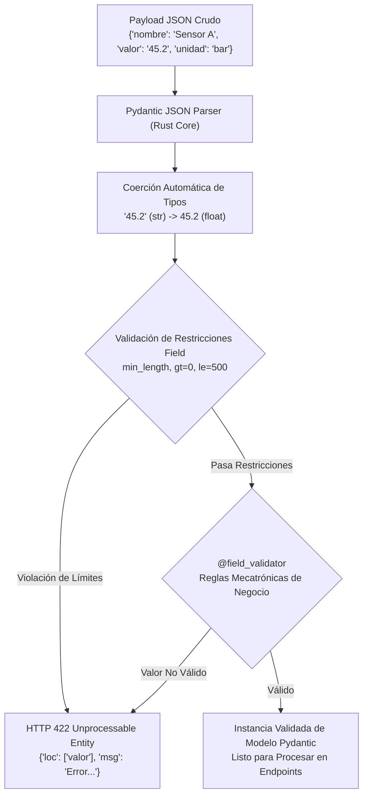
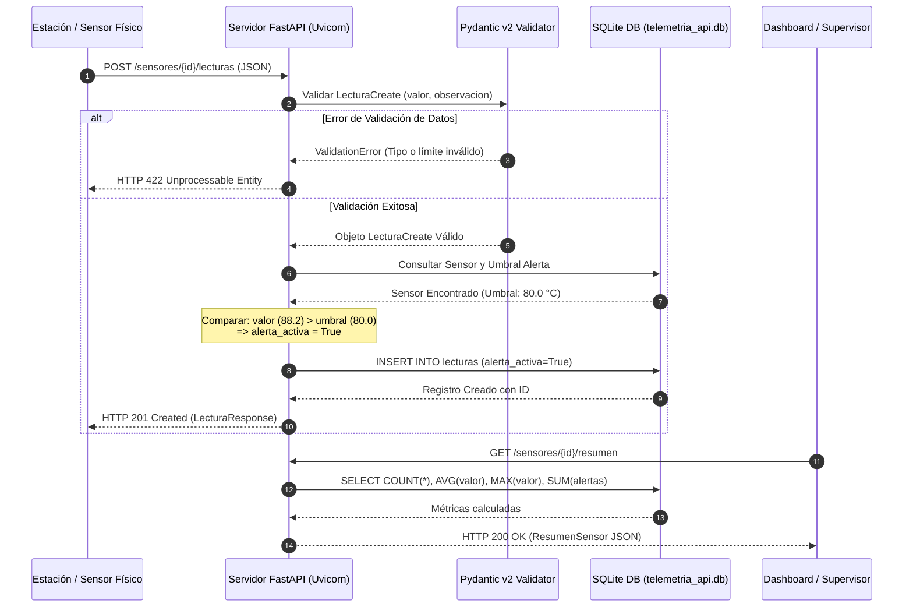

## Lenguaje de Programación Visual  
### Ingeniería Mecatrónica - FIUNA

**Semana 5: Construcción de APIs Propias con FastAPI y Pydantic**

---

**Profesor Titular:** Ing. Jorge Luis Tillería Mereles  
**Auxiliar de Práctica:** Univ. Carlos María Benítez Cardozo  
**Facultad de Ingeniería - Universidad Nacional de Asunción (FIUNA)**  
**Ciclo 2026-02**

---



---

## 📋 Tabla de Contenidos

1. [Requisitos Previos y Configuración del Entorno](#requisitos-previos-y-configuración-del-entorno)
2. [Fundamentos de Microservicios y Arquitectura ASGI](#1-fundamentos-de-microservicios-y-arquitectura-asgi)
   - [1.1 Evolución Web: WSGI vs. ASGI](#11-evolución-web-wsgi-vs-asgi)
   - [1.2 ¿Por qué FastAPI en Mecatrónica y Sistemas Ciberfísicos?](#12-por-qué-fastapi-en-mecatrónica-y-sistemas-ciberfísicos)
3. [Modelado y Validación Estricta con Pydantic v2](#2-modelado-y-validación-estricta-con-pydantic-v2)
   - [2.1 Tipado Estático, Parsing y Coerción](#21-tipado-estático-parsing-y-coerción)
   - [2.2 Restricciones Físicas con `Field` y Enumeraciones](#22-restricciones-físicas-con-field-y-enumeraciones)
   - [2.3 Validadores Personalizados con `@field_validator`](#23-validadores-personalizados-con-field_validator)
   - [2.4 Pipeline de Validación de Pydantic v2](#24-pipeline-de-validación-de-pydantic-v2)
4. [Diseño de Endpoints RESTful y Documentación OpenAPI](#3-diseño-de-endpoints-restful-y-documentación-openapi)
   - [3.1 Anatomía de un Endpoint RESTful](#31-anatomía-de-un-endpoint-restful)
   - [3.2 Inyección de Dependencias (`Depends`)](#32-inyección-de-dependencias-depends)
   - [3.3 Flujo Secuencial de Peticiones y Alertas](#33-flujo-secuencial-de-peticiones-y-alertas)
   - [3.4 Documentación Interactiva Automática (Swagger UI y ReDoc)](#34-documentación-interactiva-automática-swagger-ui-y-redoc)
5. [Arquitectura del Proyecto Didáctico (`proyecto_fastapi_pydantic`)](#4-arquitectura-del-proyecto-didáctico-proyecto_fastapi_pydantic)
6. [Guía de Ejecución y Pruebas Automatizadas](#5-guía-de-ejecución-y-pruebas-automatizadas)

---

## Requisitos Previos y Configuración del Entorno

Antes de comenzar la sesión y ejecutar el microservicio o el Jupyter Notebook, active el entorno virtual de la asignatura **`lpv2026-2`** e instale las dependencias gestionadas mediante **Poetry**:

```bash
# 1. Activar el entorno virtual de la materia
conda activate lpv2026-2

# 2. Navegar al directorio del proyecto mecatrónico
cd proyecto_fastapi_pydantic

# 3. Vincular el entorno lpv2026-2 con Poetry e instalar dependencias
poetry env use python
poetry install
```

> **Nota para Jupyter:** Si abre el archivo [`notebook_semana5_fastapi_pydantic.ipynb`](file:///d:/Materiales%20de%20Auxiliar/1.%20Lenguaje%20de%20Programacion%20Visual/proyecto_fastapi_pydantic/notebook_semana5_fastapi_pydantic.ipynb) en VS Code o JupyterLab, asegúrese de seleccionar el Kernel denominado **`Python (lpv2026-2)`**.

---

## 1. Fundamentos de Microservicios y Arquitectura ASGI

En sistemas mecatrónicos modernos, como celdas de manufactura robótica, vehículos autónomos (AGV/drones) y bancos de prueba de motores, los dispositivos ya no operan de forma aislada. Se conectan mediante **APIs REST** ligeras y de alta velocidad que permiten la telemetría en tiempo real, el control remoto y la integración con aplicaciones SCADA o tableros de control.



### 1.1 Evolución Web: WSGI vs. ASGI

| Característica | WSGI (Web Server Gateway Interface) | ASGI (Asynchronous Server Gateway Interface) |
| :--- | :--- | :--- |
| **Frameworks Representativos** | Flask, Django tradicional, Bottle. | **FastAPI**, Starlette, Sanic, Django Channels. |
| **Modelo de Ejecución** | Síncrono bloqueante (1 hilo o proceso por petición). | **Asíncrono cooperativo no bloqueante** (`asyncio`). |
| **Servidores Web Habituales** | Gunicorn, uWSGI. | **Uvicorn**, Hypercorn, Daphne. |
| **Rendimiento I/O** | Limitado ante ráfagas concurrentes masivas. | **Altísimo** (a la par de NodeJS y Go). |
| **Protocolos Soportados** | Exclusivamente HTTP/1.1 síncrono. | HTTP/1.1, HTTP/2, **WebSockets**, Server-Sent Events. |

---

### 1.2 ¿Por qué FastAPI en Mecatrónica y Sistemas Ciberfísicos?

1. **Rendimiento Ultrarrápido**: Desarrollado sobre Starlette y Pydantic v2 (cuyo núcleo está compilado en Rust), ofreciendo la menor latencia de procesamiento de tramas HTTP en el ecosistema Python.
2. **Tipado Estricto de Parámetros Físicos**: Evita errores catastróficos en actuadores (por ejemplo, rechazar números negativos en velocidades de motores o unidades incompatibles).
3. **OpenAPI Nativo**: Cualquier equipo mecatrónico o frontend visual puede consumir la API leyendo el contrato estandarizado sin necesidad de documentación manual externa.
4. **Desacoplamiento Modular**: Facilita la separación entre la capa de red, la capa de lógica de negocio y la persistencia en base de datos.

---

## 2. Modelado y Validación Estricta con Pydantic v2

**Pydantic** es el estándar de la industria en Python para la definición de contratos de datos. A diferencia de las clases tradicionales o diccionarios crudos, Pydantic realiza **coerción de tipos y validación en tiempo de ejecución**.

### 2.1 Tipado Estático, Parsing y Coerción

```python
from pydantic import BaseModel

class ParametrosMotor(BaseModel):
    id_motor: int
    velocidad_rpm: float
    activo: bool

# Pydantic realiza coerción inteligente si el valor es convertible:
m = ParametrosMotor(id_motor="102", velocidad_rpm="1450.5", activo="true")
print(type(m.id_motor), m.id_motor)          # <class 'int'> 102
print(type(m.velocidad_rpm), m.velocidad_rpm) # <class 'float'> 1450.5
print(type(m.activo), m.activo)              # <class 'bool'> True
```

---

### 2.2 Restricciones Físicas con `Field` y Enumeraciones

En ingeniería mecatrónica, las magnitudes físicas deben respetar límites mecánicos y operacionales:

```python
from enum import Enum
from pydantic import BaseModel, Field

class TipoSensor(str, Enum):
    TEMPERATURA = "temperatura"
    PRESION = "presion"
    VIBRACION = "vibracion"

class SensorConfig(BaseModel):
    nombre: str = Field(..., min_length=3, max_length=50, description="Nombre de la estación")
    tipo: TipoSensor = Field(..., description="Magnitud física censada")
    umbral_alerta: float = Field(..., gt=0.0, le=500.0, description="Umbral físico de disparo (0 < val <= 500)")
```

---

### 2.3 Validadores Personalizados con `@field_validator`

Permiten incorporar reglas de validación específicas de la lógica de control:

```python
from pydantic import BaseModel, field_validator

class LecturaPresion(BaseModel):
    valor: float
    unidad: str

    @field_validator("unidad")
    @classmethod
    def validar_unidad_presion(cls, u: str) -> str:
        unidades_validas = {"bar", "psi", "kPa", "MPa"}
        if u not in unidades_validas:
            raise ValueError(f"Unidad '{u}' no válida para presión. Opciones permitidas: {unidades_validas}")
        return u
```

---

### 2.4 Pipeline de Validación de Pydantic v2



Si un cliente HTTP envía `{"valor": 12.5, "unidad": "litros"}` a un sensor de presión, FastAPI y Pydantic interceptan automáticamente la solicitud y responden con un código **HTTP 422 Unprocessable Entity** detallando con precisión el error al cliente sin que la aplicación sufra una excepción no controlada.

---

## 3. Diseño de Endpoints RESTful y Documentación OpenAPI

---

### 3.1 Anatomía de un Endpoint RESTful

Una API RESTful modela los recursos mediante sustantivos en plural (`/sensores`, `/lecturas`) y utiliza los verbos del protocolo HTTP para definir las operaciones:

```python
from fastapi import APIRouter, HTTPException, status
from src.models import SensorCreate, SensorResponse

router = APIRouter(prefix="/sensores")

@router.post("", response_model=SensorResponse, status_code=status.HTTP_201_CREATED)
def registrar_sensor(sensor_in: SensorCreate):
    # Lógica de guardado en base de datos
    return sensor_creado
```

#### Convención de Códigos de Estado HTTP en REST:
* **`200 OK`**: Petición de lectura o actualización procesada con éxito.
* **`201 Created`**: Nuevo recurso creado exitosamente en el servidor.
* **`204 No Content`**: Eliminación exitosa sin cuerpo de respuesta.
* **`400 Bad Request`**: Solicitud con parámetros semánticamente incorrectos.
* **`404 Not Found`**: El identificador solicitado no existe en la base de datos.
* **`422 Unprocessable Entity`**: Error de validación de esquema Pydantic (tipos, límites o campos ausentes).

---

### 3.2 Inyección de Dependencias (`Depends`)

FastAPI implementa un potente sistema de **Inyección de Dependencias** (`Depends`) que permite compartir recursos compartidos como conexiones de base de datos, sesiones o autorizaciones:

```python
from fastapi import Depends
from src.database import DatabaseManager, get_db

@router.get("")
def listar_sensores(db: DatabaseManager = Depends(get_db)):
    return db.obtener_sensores()
```

---

### 3.3 Flujo Secuencial de Peticiones y Alertas

El siguiente diagrama de secuencia detalla el ciclo de vida de una lectura física de sensor transmitida a la API:



---

### 3.4 Documentación Interactiva Automática (Swagger UI y ReDoc)

Al iniciar el servidor ASGI Uvicorn, FastAPI genera automáticamente la especificación **OpenAPI 3.1.0** y expone dos interfaces gráficas interactivas:

* 🌐 **Swagger UI (`http://127.0.0.1:8000/docs`):** Permite ejecutar peticiones `GET`, `POST`, `DELETE` interactivamente desde el navegador (*Try it out*).
* 📖 **ReDoc (`http://127.0.0.1:8000/redoc`):** Vista de documentación técnica con esquemas detallados de request y response.

---

## 4. Arquitectura del Proyecto Didáctico (`proyecto_fastapi_pydantic`)

El repositorio cuenta con una implementación completa y desacoplada de una **API de Monitoreo Mecatrónico**:

```
d:\Materiales de Auxiliar\1. Lenguaje de Programacion Visual\
├── README.md                                  # Documentación principal de la materia
├── Plan de clases 2026-02.pdf
├── Manual de SQL.pdf
└── proyecto_fastapi_pydantic/                 # Microservicio FastAPI con Pydantic v2
    ├── README.md                              # Documentación técnica del microservicio
    ├── pyproject.toml                         # Configuración y dependencias con Poetry
    ├── main.py                                # Servidor ASGI Uvicorn
    ├── notebook_semana5_fastapi_pydantic.ipynb# Notebook interactivo de pruebas con TestClient
    ├── src/
    │   ├── __init__.py
    │   ├── app.py                             # Fábrica de aplicación FastAPI y CORS
    │   ├── config.py                          # Parámetros y metadatos de la API
    │   ├── models.py                          # Modelos Pydantic v2 (Request, Response, Validadores)
    │   ├── database.py                        # Persistencia SQLite desacoplada
    │   └── routes.py                          # Enrutador APIRouter con endpoints REST
    ├── tests/
    │   ├── __init__.py
    │   └── test_api.py                        # Pruebas unitarias automatizadas con TestClient
    └── data/
        └── .gitkeep                           # Directorio para base de datos SQLite
```

### Enlaces Directos a los Archivos del Proyecto:
- 🚀 **Servidor ASGI:** [proyecto_fastapi_pydantic/main.py](file:///d:/Materiales%20de%20Auxiliar/1.%20Lenguaje%20de%20Programacion%20Visual/proyecto_fastapi_pydantic/main.py)
- ⚙️ **Configuración Poetry:** [proyecto_fastapi_pydantic/pyproject.toml](file:///d:/Materiales%20de%20Auxiliar/1.%20Lenguaje%20de%20Programacion%20Visual/proyecto_fastapi_pydantic/pyproject.toml)
- 📋 **Esquemas Pydantic:** [proyecto_fastapi_pydantic/src/models.py](file:///d:/Materiales%20de%20Auxiliar/1.%20Lenguaje%20de%20Programacion%20Visual/proyecto_fastapi_pydantic/src/models.py)
- 📡 **Endpoints REST:** [proyecto_fastapi_pydantic/src/routes.py](file:///d:/Materiales%20de%20Auxiliar/1.%20Lenguaje%20de%20Programacion%20Visual/proyecto_fastapi_pydantic/src/routes.py)
- 💾 **Persistencia SQLite:** [proyecto_fastapi_pydantic/src/database.py](file:///d:/Materiales%20de%20Auxiliar/1.%20Lenguaje%20de%20Programacion%20Visual/proyecto_fastapi_pydantic/src/database.py)
- 🧪 **Pruebas Automatizadas:** [proyecto_fastapi_pydantic/tests/test_api.py](file:///d:/Materiales%20de%20Auxiliar/1.%20Lenguaje%20de%20Programacion%20Visual/proyecto_fastapi_pydantic/tests/test_api.py)
- 📓 **Jupyter Notebook Interactivo:** [proyecto_fastapi_pydantic/notebook_semana5_fastapi_pydantic.ipynb](file:///d:/Materiales%20de%20Auxiliar/1.%20Lenguaje%20de%20Programacion%20Visual/proyecto_fastapi_pydantic/notebook_semana5_fastapi_pydantic.ipynb)

---

## 5. Guía de Ejecución y Pruebas Automatizadas

### 1. Iniciar el Microservicio con Uvicorn
Con el entorno `lpv2026-2` activo:

```bash
cd proyecto_fastapi_pydantic
poetry run python main.py
```

Acceda a Swagger UI en su navegador web:
👉 **[http://127.0.0.1:8000/docs](http://127.0.0.1:8000/docs)**

---

### 2. Ejecutar la Suite de Pruebas Automatizadas
Verifique el correcto funcionamiento de los endpoints, las restricciones de validación y la persistencia SQLite:

```bash
cd proyecto_fastapi_pydantic
poetry run pytest tests/
```

#### Salida esperada en consola:
```text
============================= test session starts =============================
platform win32 -- Python 3.12.13, pytest-9.1.1, pluggy-1.6.0
rootdir: D:\Materiales de Auxiliar\1. Lenguaje de Programacion Visual\proyecto_fastapi_pydantic
configfile: pyproject.toml
plugins: anyio-4.15.0, asyncio-1.4.0
collected 6 items

tests\test_api.py ......                                                 [100%]

============================== 6 passed in 0.95s ==============================
```

---

### 3. Ejecución del Notebook Interactivo
Para una experiencia práctica celda por celda utilizando `TestClient` en memoria:

```bash
cd proyecto_fastapi_pydantic
poetry run jupyter notebook notebook_semana5_fastapi_pydantic.ipynb
```

---
*Facultad de Ingeniería - Universidad Nacional de Asunción (FIUNA)*
