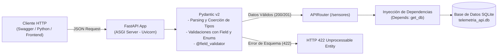
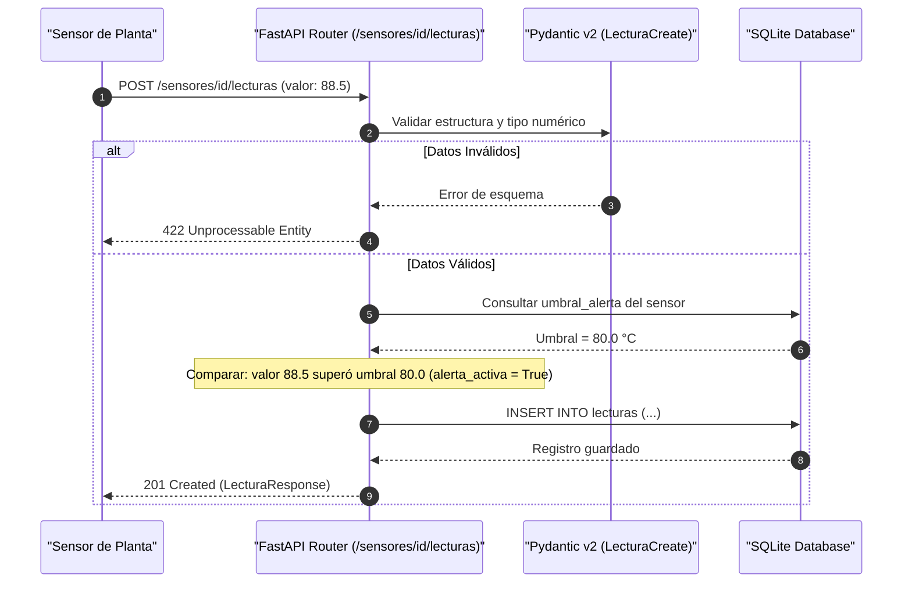

# Proyecto Didáctico: API REST de Monitoreo Mecatrónico con FastAPI y Pydantic v2

Microservicio web REST desarrollado con **FastAPI** y **Pydantic v2** para la gestión de estaciones de sensores industriales, adquisición continua de telemetría y disparo de alertas operativas por umbral de seguridad.

---

## 🛠️ Arquitectura del Microservicio



### Flujo de Adquisición y Alertas de Telemetría



---

## 🚀 Requisitos e Instalación

1. **Activar el entorno virtual de la materia:**
   ```bash
   conda activate lpv2026-2
   ```

2. **Instalar dependencias con Poetry:**
   Navegue al directorio del proyecto y ejecute:
   ```bash
   cd proyecto_fastapi_pydantic
   poetry install
   ```

---

## 💻 Instrucciones de Ejecución

### 1. Iniciar el Servidor de Desarrollo (Uvicorn)
```bash
poetry run python main.py
```
O directamente con el comando CLI de Uvicorn:
```bash
poetry run uvicorn src.app:app --reload --port 8000
```

Una vez iniciado, acceda a la documentación interactiva en su navegador:
* 🌐 **Swagger UI (Pruebas interactivas):** [http://127.0.0.1:8000/docs](http://127.0.0.1:8000/docs)
* 📖 **ReDoc (Documentación técnica):** [http://127.0.0.1:8000/redoc](http://127.0.0.1:8000/redoc)

---

### 2. Ejecutar Pruebas Automatizadas
La suite de pruebas utiliza `pytest` y `TestClient` para validar los endpoints y las restricciones de Pydantic:

```bash
poetry run pytest tests/
```

---

### 3. Explorar el Notebook Interactivo
Para una demostración paso a paso sin necesidad de levantar el servidor web externamente:
```bash
poetry run jupyter notebook notebook_semana5_fastapi_pydantic.ipynb
```

---

## 📡 Tabla de Endpoints de la API

| Método | Endpoint | Código HTTP | Descripción |
| :--- | :--- | :---: | :--- |
| `GET` | `/` | `200 OK` | Verificación de salud y metadatos de la API. |
| `GET` | `/sensores` | `200 OK` | Listar todos los sensores (admite filtros `?tipo=` y `?activo=`). |
| `POST` | `/sensores` | `201 Created` | Registrar un nuevo sensor mecatrónico (validación Pydantic). |
| `GET` | `/sensores/{id}` | `200 OK` / `404` | Obtener las especificaciones y estado de un sensor. |
| `DELETE` | `/sensores/{id}` | `204 No Content` / `404` | Eliminar un sensor y sus mediciones asociadas. |
| `POST` | `/sensores/{id}/lecturas` | `201 Created` / `404` | Ingresar medición física y evaluar umbral de alerta. |
| `GET` | `/sensores/{id}/lecturas` | `200 OK` / `404` | Historial cronológico de lecturas del sensor. |
| `GET` | `/sensores/{id}/resumen` | `200 OK` / `404` | Estadísticas descriptivas (Promedio, Mín, Máx, Alertas). |

---

## 📁 Estructura del Proyecto

```
proyecto_fastapi_pydantic/
├── README.md                              # Documentación y guía del microservicio
├── pyproject.toml                         # Especificación y dependencias con Poetry
├── main.py                                # Servidor ASGI Uvicorn
├── notebook_semana5_fastapi_pydantic.ipynb# Notebook interactivo de consumo y pruebas
├── src/
│   ├── __init__.py
│   ├── app.py                             # Fábrica de aplicación FastAPI y middleware CORS
│   ├── config.py                          # Rutas y metadatos del servicio
│   ├── models.py                          # Modelos Pydantic v2 (Request/Response/Enums)
│   ├── database.py                        # Persistencia SQLite y Dependency Injection
│   └── routes.py                          # Endpoints REST para sensores y telemetría
├── tests/
│   ├── __init__.py
│   └── test_api.py                        # Pruebas con TestClient y pytest
└── data/
    └── .gitkeep                           # Directorio para telemetria_api.db
```
