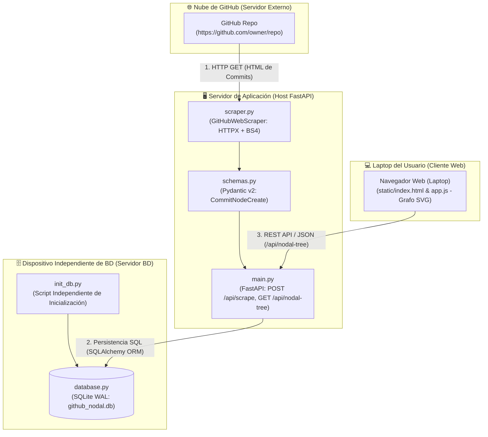

# Guía del Proyecto: Web Scraping de Repositorios GitHub, Pydantic v2, FastAPI y Visualización del Árbol Nodal de Cambios

---

## Resumen del Proyecto

Este proyecto combina los contenidos de las **Semanas 4 y 5** en un único desarrollo integral. Presenta la problemática del tipado dinámico en Python, demuestra el uso de **Pydantic v2** para la validación estricta de datos, implementa un motor de **Web Scraping** para extraer historiales de repositorios en GitHub (siguiendo las mejores prácticas del informe técnico de *ScraperAPI*), persiste la información en una base de datos relacional y expone una **API REST con FastAPI** que alimenta un **visualizador web interactivo del árbol nodal de cambios**.

---

## Topología de Despliegue y Arquitectura del Sistema



---

## Estructura del Repositorio

```
proyecto_github_nodal/
├── pyproject.toml               # Configuración de dependencias gestionada con Poetry
├── database.py                  # Motor de persistencia SQLite WAL y modelos ORM
├── init_db.py                   # Script independiente para inicializar y poblar la BD
├── schemas.py                   # Esquemas Pydantic v2 para validación y árbol nodal
├── scraper.py                   # Motor de Web Scraping (HTTPX + BeautifulSoup4 + User-Agent rotation)
├── main.py                      # Aplicación REST en FastAPI y router de estáticos
├── notebook_semana_4_y_5.ipynb  # Notebook interactivo para los estudiantes
├── static/
│   ├── index.html               # Interfaz web del visualizador del árbol nodal
│   ├── styles.css               # Diseño moderno en modo oscuro con Glassmorphism
│   └── app.js                   # Lógica JS de renderizado de grafo SVG y consumo de API REST
└── README.md                    # Documentación técnica del proyecto
```

---

## Instrucciones de Instalación y Ejecución

### 1. Requisitos Previos y Entorno Virtual

Active el entorno virtual de la materia e instale las dependencias con **Poetry**:

```bash
# 1. Activar el entorno conda
conda activate lpv2026-2

# 2. Navegar al directorio del proyecto
cd "d:\Materiales de Auxiliar\1. Lenguaje de Programacion Visual\proyecto_github_nodal"

# 3. Instalar dependencias con Poetry
poetry env use python
poetry install
```

### 2. Inicialización Independiente de la Base de Datos

Ejecute el script desacoplado para crear las tablas en la base de datos local `github_nodal.db` e insertar los datos semilla iniciales:

```bash
poetry run python init_db.py
```

### 3. Ejecución del Servidor Web FastAPI

Inicie la API REST y el servidor de archivos estáticos con Uvicorn:

```bash
poetry run uvicorn main:app --reload --host 127.0.0.1 --port 8000
```

### 4. Acceso a las Interfaces

- **Visualizador Web del Árbol Nodal:** [http://127.0.0.1:8000/](http://127.0.0.1:8000/)
- **Documentación Interactiva Swagger (OpenAPI 3.1):** [http://127.0.0.1:8000/docs](http://127.0.0.1:8000/docs)
