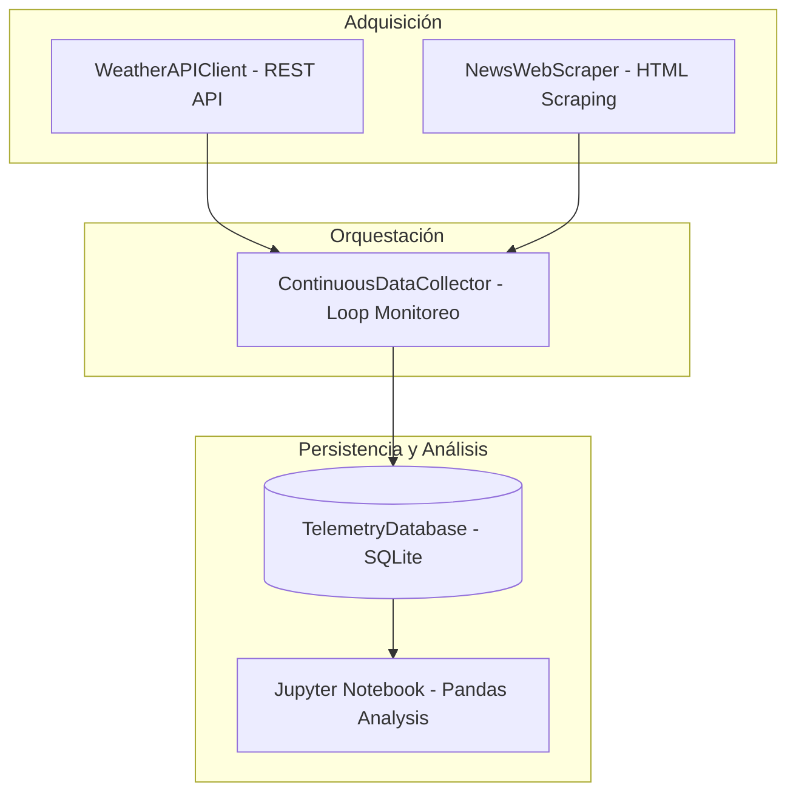

## Proyecto 3: Adquisición Continua y Análisis de Datos (REST API + Web Scraping + SQLite)

**Lenguaje de Programación Visual - Semana 4**  
*Ingeniería Mecatrónica - FIUNA*

---

## 1. Visión General del Proyecto

Este proyecto práctico demuestra la implementación de un sistema modular completo para la adquisición continua de datos remotos combinando dos paradigmas fundamentales de la web:
1. **Consumo de APIs REST (JSON):** Obtención estructurada de telemetría meteorológica en tiempo real (Open-Meteo API).
2. **Web Scraping Sintáctico (HTML):** Extracción automatizada de titulares y boletines mediante `BeautifulSoup4` y Selectores CSS.
3. **Persistencia Relacional en Tiempo Real:** Almacenamiento directo de registros en una base de datos relacional **SQLite**.
4. **Análisis Interactivos:** Entorno de exploración visual de datos con **Jupyter Notebook** (`.ipynb`) y **Pandas**.
5. **Gestión de Entorno con Poetry:** Entorno desacoplado y reproducible mediante `pyproject.toml`.



---

## 2. Estructura del Proyecto

```text
proyecto_rest_scraping/
├── data/
│   └── .gitkeep                     # Directorio para la BD SQLite (telemetry_scraping.db)
├── notebook_semana4_rest_scraping.ipynb  # Notebook de laboratorio interactivo
├── main.py                          # Script ejecutable de monitoreo continuo
├── pyproject.toml                   # Definición de dependencias de Poetry
├── README.md                        # Guía técnica del proyecto
├── src/
│   ├── __init__.py
│   ├── api_client.py                # Cliente HTTP para APIs REST
│   ├── collector.py                 # Orquestador del ciclo de recolección continua
│   ├── config.py                    # Parámetros globales y URLs objetivo
│   ├── database.py                 # Capa de persistencia SQLite y esquemas SQL
│   └── scraper.py                   # Parser HTML con BeautifulSoup4
└── tests/
    ├── __init__.py
    └── test_collector.py            # Suite de pruebas unitarias con Pytest
```

---

## 3. Esquema de Base de Datos (SQLite)

La base de datos relacional `telemetry_scraping.db` maneja dos tablas principales:

```sql
-- 1. Registro de Telemetría desde API REST
CREATE TABLE api_telemetry_logs (
    id INTEGER PRIMARY KEY AUTOINCREMENT,
    origen TEXT NOT NULL,
    temperatura REAL NOT NULL,
    velocidad_viento REAL NOT NULL,
    direccion_viento REAL NOT NULL,
    codigo_clima INTEGER NOT NULL,
    estado_http INTEGER NOT NULL,
    registrado_en TIMESTAMP DEFAULT CURRENT_TIMESTAMP
);

-- 2. Registro de Titulares desde Web Scraping
CREATE TABLE scraped_bulletins (
    id INTEGER PRIMARY KEY AUTOINCREMENT,
    posicion INTEGER NOT NULL,
    titulo TEXT NOT NULL,
    url TEXT NOT NULL,
    longitud_titulo INTEGER NOT NULL,
    registrado_en TIMESTAMP DEFAULT CURRENT_TIMESTAMP
);
```

---

## 4. Instalación y Ejecución

### Requisitos Previos
* **Python** ^3.10
* **Poetry** (Gestor de entornos virtuales)

### 4.1 Instalación de Dependencias con Poetry
En la terminal, diríjase a la carpeta del proyecto e instale las dependencias:

```bash
cd proyecto_rest_scraping
poetry install
```

### 4.2 Ejecución del Servicio de Recolección Continua
Para iniciar el servicio en tiempo real (recolección continua cada 5 segundos):

```bash
poetry run python main.py
```

Para especificar un intervalo personalizado y número límite de ciclos:

```bash
poetry run python main.py --interval 2.0 --cycles 5
```

### 4.3 Ejecución del Jupyter Notebook Interactivo
Para abrir el notebook de laboratorio de la Semana 4:

```bash
poetry run jupyter notebook notebook_semana4_rest_scraping.ipynb
```

### 4.4 Ejecución de Pruebas Unitarias
Para verificar el correcto funcionamiento del pipeline y la base de datos:

```bash
poetry run pytest
```
